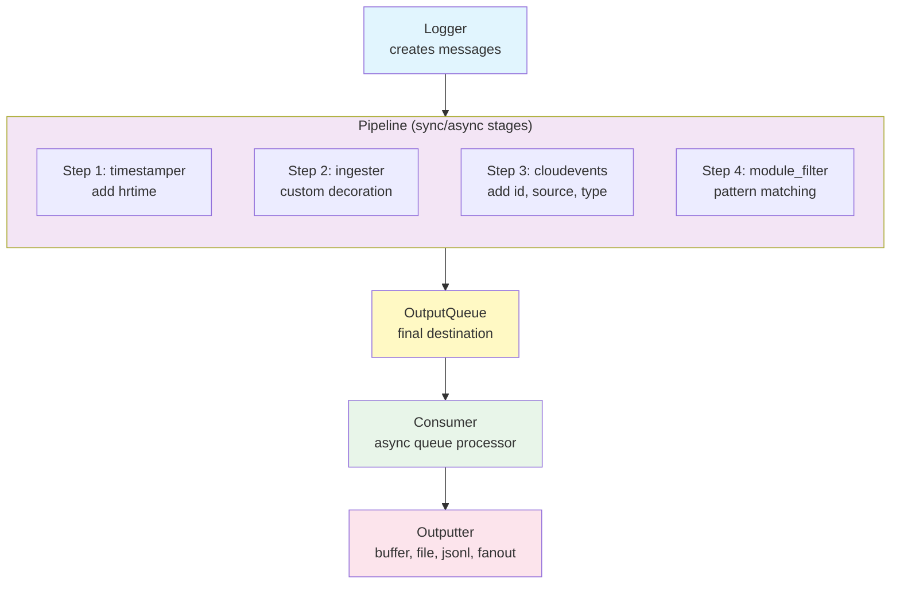

# termichatter-nvim

> Asynchronous structured-data-flow atop coop.nvim, with a side of logging.

## Table of Contents

- [Features](#features)
- [Installation](#installation)
- [Quick Start](#quick-start)
- [Architecture](#architecture)
- [Modules](#modules)
- [Pipeline](#pipeline)
- [Sync and Async Pipeline Patterns](#sync-and-async-pipeline-patterns)
- [Loggers](#loggers)
- [Processors](#processors)
- [Consumers](#consumers)
- [Outputters](#outputters)
- [Drivers](#drivers)
- [Structured Messages](#structured-messages)
- [API Reference](#api-reference)

## Features

- **Low-cost message sending** - synchronous fast path for logging, async processing downstream
- **Module filtering** - npm `debug`-style pattern matching to control which modules emit logs
- **Priority levels** - error, warn, info, log, debug, trace with filtering support
- **High-resolution timestamps** - `vim.uv.hrtime()` captured at message creation
- **CloudEvents compatible** - messages enriched with id, source, specversion, type
- **Recursive context inheritance** - loggers inherit from modules inherit from parent modules
- **Multiple output destinations** - buffer, file, fanout, JSON Lines
- **Async queue processing** - coop.nvim mpsc queues for async stages
- **Flexible drivers** - interval and rescheduler patterns for consumers

## Installation

Requires [coop.nvim](https://github.com/gregorias/coop.nvim) as a dependency.

Using lazy.nvim:
```lua
{
    "rektide/nvim-termichatter",
    dependencies = { "gregorias/coop.nvim" },
}
```

## Quick Start

```lua
local termichatter = require("termichatter")

-- Create a module for your application
local app = termichatter.makePipeline({
    source = "myapp:main",
})

-- Create a logger (using colon syntax for inheritance)
local log = app:baseLogger({ module = "startup" })

-- Log messages at different priority levels
log.info("Application starting")
log.debug({ message = "Config loaded", config = { debug = true } })
log.error("Something went wrong")

-- Messages are in app.outputQueue, ready for consumption
```

## Testing

Run the test suite using busted:

```bash
# Run all tests
nvim -l tests/busted.lua

# Run specific test file
nvim -l tests/busted.lua tests/termichatter/unified_pipeline_spec.lua
```

Tests are organized by module in the `tests/termichatter/` directory.

## Benchmarking Lua Test Suites with cargo-criterion

You can benchmark each Lua test suite (`*_spec.lua`) through Rust Criterion so you get per-suite regression tracking and HTML reports.

Benchmarks run a matrix: `implementation x testsuite`.

- `default` implementation uses the code in `lua/termichatter/`
- extra implementations are auto-discovered in `implementations/<name>/lua/termichatter/init.lua`

Prerequisites:

- `nvim` available on `PATH`
- test dependency checkout present at `.test-agent/coop`
- `cargo-criterion` installed (`cargo install cargo-criterion`)

Run a benchmark pass with automatic history tracking:

```bash
cargo run --bin bench-history
```

What this does:

- runs `cargo criterion --bench lua_suites`
- tags the run with a unique `--history-id` (timestamp + git commit)
- appends run metadata to `.criterion-history/runs.jsonl`
- benchmarks every discovered `<implementation>/<suite>` pair

Reports:

- consolidated HTML report: `target/criterion/report/index.html`
- benchmark data and history snapshots: `target/criterion/`

If you want a one-off manual history label:

```bash
cargo criterion --bench lua_suites --history-id local-change-a
```

Run tests against a specific implementation:

```bash
TERMICHATTER_IMPL=default nvim -l tests/busted.lua
TERMICHATTER_IMPL=my-new-impl nvim -l tests/busted.lua
```

Implementation layout:

```text
implementations/
  my-new-impl/
    lua/
      termichatter/
        init.lua
        processors.lua
        consumer.lua
        ...
```

`tests/busted.lua` prepends the selected implementation's Lua path before the default project path, so missing modules can fall back to `lua/termichatter/` while you iterate.

## Architecture

termichatter uses a pipeline architecture where messages flow through a series of handlers:



### Key Concepts

- **Module**: A context containing pipeline configuration, handlers, and inheritable fields
- **Pipeline**: Array of handler names/functions executed in order
- **Queues**: Optional mpsc queues at pipeline stages for async handoff
- **Logger**: Callable that creates messages and sends through pipeline
- **Consumer**: Async task that pops from queues and processes messages
- **Outputter**: Writes messages to a destination (buffer, file, etc.)

### Recursive Context

termichatter emphasizes recursive context inheritance. A message might inherit context from:

```
termichatter (root) → app module → auth module → jwt logger → message
```

Each level can override or extend fields from its parent. When looking up handlers, the system walks up the inheritance chain via metatables.

## Modules

Modules are the organizational unit. They hold pipeline configuration and provide context for loggers.

### Creating Modules

```lua
local termichatter = require("termichatter")

-- Create a root module
local app = termichatter.makePipeline({
    source = "myapp",
    environment = "production",
})

-- Create child module (inherits from app)
local auth = app:makePipeline({
    source = "myapp:auth",
    component = "authentication",
})

-- Child inherits parent's fields
print(auth.environment)  -- "production"
```

### Module Fields

| Field | Description |
|-------|-------------|
| `pipeline` | Array of handler names executed in order |
| `queues` | Corresponding array of mpsc queues (nil = sync) |
| `outputQueue` | Final destination queue for processed messages |
| `source` | Default source URI for messages |
| `filter` | Pattern or function for module filtering |
| `timestamper` | Function to add timestamps |
| `ingester` | Function to decorate messages |
| `cloudevents` | Function to add CloudEvents fields |
| `module_filter` | Function to filter by source pattern |

### Adding Processors

```lua
-- Add a handler to the pipeline
app:addProcessor("myHandler", function(msg, self)
    msg.customField = "value"
    return msg
end)

-- Add at specific position with queue
app:addProcessor("asyncStage", handler, 2, true)  -- position 2, with queue
```

## Pipeline

The pipeline is the heart of message processing. Each stage can transform, enrich, or filter messages.

### Default Pipeline

| Step | Handler | Description |
|------|---------|-------------|
| 1 | `timestamper` | Adds `time` field via `vim.uv.hrtime()` |
| 2 | `ingester` | Custom decoration (no-op by default) |
| 3 | `cloudevents` | Adds `id`, `source`, `specversion` |
| 4 | `module_filter` | Filters by source/module pattern |

### How `log()` Works

```lua
termichatter.log(msg, self)
```

1. Sets `msg.pipeStep = 1` if not present
2. For each step in `self.pipeline`:
   - Check if `self.queues[step]` exists
   - If queue: push message and return (async handoff)
   - If no queue: resolve handler, run it, advance step
3. Handler returning `nil` stops processing (filtered)
4. After all stages, push to `self.outputQueue`

### Handler Resolution

Pipeline entries can be:

| Type | Behavior |
|------|----------|
| `function` | Called directly with `(msg, self)` |
| `string` | Looked up on `self`, then evaluated |

## Sync and Async Pipeline Patterns

termichatter uses a **unified pipeline model** where sync and async stages are interleaved in a single `pipeline`/`queues` pair. The `queues` array is parallel to `pipeline` - if `queues[i]` is non-nil, that stage is async.

### The Unified Model

```lua
local MpscQueue = require("coop.mpsc-queue").MpscQueue

local app = termichatter.makePipeline({ source = "myapp" })

-- Define pipeline stages
app.pipeline = { "validate", "enrich", "filter", "format" }

-- Define which stages are async (nil = sync)
app.queues = { nil, MpscQueue.new(), nil, MpscQueue.new() }
--              sync   async         sync   async

-- Define handlers
app.validate = function(msg, self) ... end
app.enrich = function(msg, self) ... end
app.filter = function(msg, self) ... end
app.format = function(msg, self) ... end

-- Start consumers for async stages
local tasks = termichatter.startConsumers(app)

-- Log messages - sync stages run immediately, async stages hand off
local log = app:baseLogger({})
log.info("Message flows through interleaved sync/async stages")

-- When done, signal completion
termichatter.finish(app)

-- Wait for consumers to complete
for _, task in ipairs(tasks) do
    task:await(1000, 10)
end
```

### How It Works

1. **Sync stages**: Handler runs immediately, advances to next step
2. **Async stages**: Message pushed to queue, control returns to caller
3. **Consumers**: `startConsumers()` spawns tasks that pop from queues and continue the pipeline
4. **Resumption**: When a consumer processes a message, it runs the handler at that step, then calls `log()` to continue through remaining stages
5. **Completion**: `finish()` sends a done message through all queues

```
log() ─→ [step1 sync] ─→ [step2 queue] ─→ return
                              │
                    consumer pops, runs step2
                              │
                         [step3 sync] ─→ [step4 queue] ─→ done
                                              │
                                    consumer pops, runs step4
                                              │
                                         outputQueue
```

### Pattern 1: Fully Synchronous (Default)

All pipeline stages run synchronously. Messages land in `outputQueue` immediately.

```lua
local app = termichatter.makePipeline({ source = "myapp" })
local log = app:baseLogger({})

log.info("This runs synchronously through all stages")
-- Message is now in app.outputQueue
```

**Use when**: Low latency is critical, processing is fast, no blocking operations.

### Pattern 2: Sync Pipeline → Async Output Consumer

Pipeline runs sync, then async consumers process from `outputQueue`.

```lua
local coop = require("coop")
local outputters = require("termichatter.outputters")

local app = termichatter.makePipeline({ source = "myapp" })

-- Async consumer writes to buffer
local bufOut = outputters.buffer({ n = bufnr, queue = app.outputQueue })
coop.spawn(function()
    bufOut:start()  -- loops on queue:pop()
end)

-- Logging is still fast (sync)
local log = app:baseLogger({})
log.info("Fast sync logging")
log.debug("Consumer processes async")
```

**Use when**: Fast logging path needed, output can be batched/async.

### Pattern 3: Interleaved Sync/Async Stages

Use `startConsumers()` to automatically spawn consumers for async stages in the pipeline.

```lua
local MpscQueue = require("coop.mpsc-queue").MpscQueue

local app = termichatter.makePipeline({ source = "myapp" })

-- Custom pipeline with async at step 2
app.pipeline = { "validate", "slowEnrich", "format" }
app.queues = { nil, MpscQueue.new(), nil }

app.validate = function(msg, self)
    -- runs sync
    return msg
end
app.slowEnrich = function(msg, self)
    -- runs async (after consumer picks up)
    msg.enriched = true
    return msg
end
app.format = function(msg, self)
    -- runs sync (after slowEnrich)
    return msg
end

-- Start consumers - spawns task for the queue at step 2
local tasks = termichatter.startConsumers(app)

-- Log messages
local log = app:baseLogger({})
log.info("validate runs sync, slowEnrich async, format continues sync")

-- Signal completion when done
termichatter.finish(app)
```

**Use when**: Some stages are slow/blocking (network, disk), want to free up caller.

### Pattern 4: Standalone Consumer Pipeline

The `consumer` module provides an alternative for building entirely separate async processing chains.

```lua
local consumer = require("termichatter.consumer")
local MpscQueue = require("coop.mpsc-queue").MpscQueue

local inputQ = MpscQueue.new()
local outputQ = MpscQueue.new()

local pipeline = consumer.createPipeline({
    { handlers = { enricher } },
    { handlers = { filter } },
    { handlers = { formatter } },
}, inputQ, outputQ)

pipeline:start()  -- spawns async tasks for each stage

-- Push messages (from sync code)
pipeline:push({ message = "hello" })
pipeline:finish()  -- signals completion
```

**Use when**: Building a separate processing chain outside the main module pipeline.

### Pattern 5: Hybrid with Dynamic Queue Selection

Use a function for queue selection based on message content.

```lua
local app = termichatter.makePipeline({ source = "myapp" })

-- Queue selection function
app.queues[3] = function(msg)
    if msg.priority == "error" then
        return app.errorQueue  -- fast path for errors
    end
    return app.normalQueue  -- normal async path
end
```

**Use when**: Different messages need different processing paths.

### Pattern 6: Fan-out to Multiple Consumers

Single producer, multiple async consumers.

```lua
local outputters = require("termichatter.outputters")

local app = termichatter.makePipeline({ source = "myapp" })

local fan = outputters.fanout({
    queue = app.outputQueue,
    outputters = {
        outputters.buffer({ n = logBuffer }),
        outputters.file({ filename = "app.log" }),
        outputters.jsonl({ filename = "events.jsonl" }),
    },
})

coop.spawn(function() fan:start() end)
```

### Completion Protocol

When using async queues, signal completion with:

```lua
queue:push(termichatter.completion.done)
-- or
queue:push({ type = "termichatter.completion.done" })
```

Consumers check for this message type to know when to stop.

## Loggers

Loggers are the primary API for sending messages. They're callable tables with priority methods.

### Creating Loggers

```lua
local log = app:baseLogger({
    source = "myapp:auth",
    module = "jwt",
    userId = 123,  -- custom field included in all messages
})
```

### Logging Messages

```lua
-- String message
log.info("User logged in")

-- Structured message
log.error({
    message = "Authentication failed",
    code = 401,
    attempts = 3,
})

-- Direct call (no priority)
log({ message = "Raw event", type = "myapp.custom" })
```

### Priority Levels

| Method | Level | Use Case |
|--------|-------|----------|
| `log.error()` | 1 | Errors requiring attention |
| `log.warn()` | 2 | Warnings, degraded state |
| `log.info()` | 3 | Normal operational messages |
| `log.log()` | 4 | General logging |
| `log.debug()` | 5 | Debug information |
| `log.trace()` | 6 | Detailed tracing |

### Logger Context

Access the logger's context:

```lua
local log = app:baseLogger({ module = "auth" })
print(log.ctx.module)   -- "auth"
print(log.ctx.source)   -- inherited from app
```

## Processors

Processors are async queue consumers that transform or filter messages.

```lua
local processors = require("termichatter.processors")
```

### ModuleFilter

npm `debug`-style filtering by source/module patterns.

```lua
local filter = processors.ModuleFilter({
    patterns = { "^myapp:auth", "^myapp:api" },  -- include these
    exclude = { "verbose" },                      -- exclude these
    inputQueue = inputQ,
    outputQueue = outputQ,
})

coop.spawn(function() filter:start() end)
```

### CloudEventsEnricher

Stamps CloudEvents spec fields onto messages.

```lua
local enricher = processors.CloudEventsEnricher({
    source = "https://myapp.example.com",
    type = "myapp.log.v1",
})
```

### PriorityFilter

Filters by log level.

```lua
local filter = processors.PriorityFilter({
    minLevel = 1,  -- error
    maxLevel = 3,  -- info (excludes debug, trace)
})

-- Dynamic adjustment
filter:setMinLevel("warn")
```

### Transformer

Custom transformation function.

```lua
local transformer = processors.Transformer({
    transform = function(msg)
        msg.processed_at = os.time()
        if msg.sensitive then
            msg.data = "[REDACTED]"
        end
        return msg  -- or nil to filter
    end,
})
```

## Consumers

The consumer module provides async message processing from queues.

```lua
local consumer = require("termichatter.consumer")
```

### Single Consumer

```lua
local c = consumer.create({
    inputQueue = inputQ,
    outputQueue = outputQ,
    handlers = {
        function(msg) msg.step1 = true; return msg end,
        function(msg) return msg.keep and msg or nil end,
    },
})

local task = c:spawn()  -- returns coop Task
-- ... later
c:stop()
```

### Consumer Pipeline

Chain multiple consumers with intermediate queues:

```lua
local pipeline = consumer.createPipeline({
    { handlers = { timestamper } },
    { handlers = { enricher, validator } },
    { handlers = { formatter } },
}, inputQ, outputQ)

local tasks = pipeline:start()

pipeline:push({ message = "hello" })
pipeline:push({ message = "world" })
pipeline:finish()

-- Wait for completion
for _, task in ipairs(tasks) do
    task:await(1000, 10)
end
```

## Outputters

Outputters consume from queues and write to destinations.

```lua
local outputters = require("termichatter.outputters")
```

### Buffer Outputter

Writes to a Neovim buffer.

```lua
local bufOut = outputters.buffer({
    n = vim.api.nvim_create_buf(false, true),
    queue = app.outputQueue,
    format = function(msg)  -- optional custom formatter
        return string.format("[%s] %s", msg.priority, msg.message)
    end,
})

coop.spawn(function() bufOut:start() end)
```

### File Outputter

Appends to a file.

```lua
local fileOut = outputters.file({
    filename = "/var/log/myapp.log",
    queue = app.outputQueue,
})
```

### JSON Lines Outputter

Writes messages as JSON Lines (one JSON object per line).

```lua
local jsonOut = outputters.jsonl({
    filename = "events.jsonl",
    queue = app.outputQueue,
})
```

### Fanout Outputter

Forwards to multiple outputters.

```lua
local fan = outputters.fanout({
    queue = app.outputQueue,
    outputters = { bufOut, fileOut, jsonOut },
})

-- Add more dynamically
fan:add(anotherOutputter)
```

## Drivers

Drivers schedule periodic execution for consumers.

### Interval Driver

Fixed interval scheduling.

```lua
local driver = termichatter.drivers.interval(100, function()
    -- Called every 100ms
    processMessages()
end)

driver.start()
-- ... later
driver.stop()
```

### Rescheduler Driver

Adaptive rescheduling with optional backoff when idle.

```lua
local driver = termichatter.drivers.rescheduler({
    interval = 50,       -- base interval
    backoff = 1.5,       -- multiply by this when idle
    maxInterval = 2000,  -- cap at 2 seconds
}, function()
    local hadWork = processMessages()
    return hadWork  -- return true to reset interval
end)
```

## Structured Messages

Messages are Lua tables with conventional fields based on CloudEvents spec.

### Standard Fields

| Field | Description |
|-------|-------------|
| `time` | High-resolution timestamp (hrtime nanoseconds) |
| `id` | Unique identifier (UUID v4) |
| `source` | Origin URI (e.g., "myapp:auth:jwt") |
| `type` | Event type in reverse domain notation |
| `specversion` | CloudEvents version ("1.0") |
| `priority` | Log level name (error, warn, info, etc.) |
| `priorityLevel` | Numeric priority (1-6) |
| `message` | Human-readable message string |
| `module` | Module name within source |
| `pipeStep` | Current pipeline step (internal) |

### Custom Fields

Add any fields you need:

```lua
log.info({
    message = "Request completed",
    duration_ms = 42,
    status_code = 200,
    user_id = "abc123",
    request_id = req.id,
})
```

### OpenTelemetry Compatibility

For OTEL semantic conventions, use standard attribute names:

```lua
log.info({
    message = "HTTP request",
    ["http.method"] = "GET",
    ["http.url"] = "/api/users",
    ["http.status_code"] = 200,
})
```

## API Reference

### termichatter (main module)

| Function | Description |
|----------|-------------|
| `module:makePipeline(config)` | Create child module inheriting from module |
| `module:baseLogger(config)` | Create logger inheriting from module |
| `log(msg, self)` | Send message through pipeline |
| `continue(msg, self)` | Continue message from current pipeStep |
| `startConsumers(self)` | Spawn consumers for all queues in pipeline |
| `stopConsumers(self)` | Cancel running consumer tasks |
| `finish(self)` | Signal completion to pipeline |
| `makeQueueConsumer(queue, step, self)` | Create consumer function for a queue |
| `isCompletion(msg)` | Check if message is completion signal |
| `addProcessor(self, name, handler, pos, withQueue)` | Add pipeline stage |
| `timestamper(msg)` | Add timestamp |
| `cloudevents(msg, self)` | Add CloudEvents fields |
| `module_filter(msg, self)` | Filter by pattern |
| `uuid()` | Generate UUID v4 |
| `completion.hello` | Hello signal message |
| `completion.done` | Done signal message |
| `drivers.interval(ms, cb)` | Create interval driver |
| `drivers.rescheduler(config, cb)` | Create rescheduler driver |

### processors module

| Function | Description |
|----------|-------------|
| `ModuleFilter(config)` | Pattern-based source filter |
| `CloudEventsEnricher(config)` | Add CE fields |
| `PriorityFilter(config)` | Filter by log level |
| `Transformer(config)` | Custom transform |

### outputters module

| Function | Description |
|----------|-------------|
| `buffer(config)` | Write to nvim buffer |
| `file(config)` | Append to file |
| `jsonl(config)` | Write JSON Lines |
| `fanout(config)` | Forward to multiple |

### consumer module

| Function | Description |
|----------|-------------|
| `create(config)` | Create single consumer |
| `createPipeline(stages, inputQ, outputQ)` | Create consumer chain |
| `withDriver(config)` | Add driver to consumer |

## License

MIT
