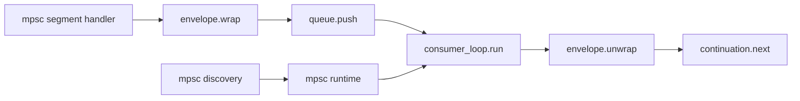

# MPSC Decomposition

> Partially superseded by: [`/doc/adr/adr-transport-policy-interface.md`](/doc/adr/adr-transport-policy-interface.md).
>
> This note remains useful for decomposition ideas, but terminology around dispatch and async handler shape may differ from the current handler-first contract.

This note expands decomposition options for [`/lua/termichatter/segment/mpsc.lua`](/lua/termichatter/segment/mpsc.lua) so queue-backed segments are reusable, explicit, and composable.

Related references:
- [`/lua/termichatter/consumer.lua`](/lua/termichatter/consumer.lua)
- [`/lua/termichatter/line.lua`](/lua/termichatter/line.lua)
- [`/lua/termichatter/segment/define.lua`](/lua/termichatter/segment/define.lua)
- [`/lua/termichatter/segment/completion.lua`](/lua/termichatter/segment/completion.lua)
- [`/doc/discovery/adr-async-boundary-segments.md`](/doc/discovery/adr-async-boundary-segments.md)

## Themes

- **Explicit boundary semantics**: queue boundaries should be visible in the pipe.
- **Composable internals**: mpsc should be assembled from small tools, not one bespoke segment.
- **Reusable queue-backed runtime**: other queue segments should reuse the same lifecycle and loop code.
- **Clear ownership**: segment owns boundary behavior; runtime owns task start/stop; protocol owns control state.

## Option 1: Split Envelope From Transport

Create `segment/mpsc/envelope.lua` for queue payload encode/decode.

Current envelope is effectively:

```lua
{ __termichatter_handoff_run = continuation_run }
```

### What constitutes the envelope

- Boundary payload wrapper used when crossing a queue.
- Must include enough data for the consumer loop to resume continuation safely.
- Should validate shape before dispatch.

Potential API:

- `envelope.wrap(continuation) -> payload`
- `envelope.unwrap(payload) -> continuation|nil, err|nil`
- `envelope.is_envelope(payload) -> boolean`

### Who uses envelope

- `mpsc_handoff.handler`: wraps continuation before `queue:push(...)`.
- queue consumer loop: unwraps and validates before `continuation:next()`.
- tests: can assert encoded/decoded structure without spinning queue tasks.

Why this helps:
- Keeps queue wiring independent from payload structure.
- Enables future metadata (`boundary_id`, tracing tags) without touching runtime loop.

## Option 2: Split Runtime From Segment Definition

Use two modules:

- `segment/mpsc/runtime.lua`
- `segment/mpsc/segment.lua`

### What goes in `runtime.lua`

- Queue-task lifecycle:
  - `ensure_queue_consumer(line, queue)`
  - `stop_queue_consumer(line, queue)`
  - optional `await_queue_stopped(line, queue, timeout, interval)`
- Shared task utilities (`is_task_active`, cancel+await normalization).
- Queue loop spawn integration (using consumer loop adapter if split further).

### What goes in `segment/mpsc/segment.lua`

- Segment-facing behavior only:
  - `mpsc_handoff(config)`
  - `mpsc_handoff_factory()`
  - `is_mpsc_handoff(seg)`
- `ensure_prepared` and `ensure_stopped` delegate to runtime.
- `handler` delegates envelope encode and continuation strategy.

Why this helps:
- Segment is declarative and policy-focused.
- Runtime is reusable by other queue-backed segments.

## Option 3: Generic Queue-Boundary Segment Factory

This is the generalized form of Option 2.

Create a factory like:

```lua
queue_boundary.create({
  type = "mpsc_handoff",
  queue = ...,                -- queue source
  to_envelope = function(run) ... end,
  from_envelope = function(payload) ... end,
  ensure_runtime = function(line, queue) ... end,
  stop_runtime = function(line, queue) ... end,
})
```

Then `mpsc_handoff` becomes one specialization, not a bespoke implementation.

### Why this composes well

Other queue-backed segments can reuse the same boundary skeleton:
- delayed queue boundary
- retry queue boundary
- batch queue boundary
- priority queue boundary

## Option 4: Separate Consumer Loop Adapter

This idea is to isolate the core queue loop into a pure adapter module.

Example module: `segment/mpsc/consumer_loop.lua`

Potential API:

- `consumer_loop.run(queue, decode, dispatch, on_error?)`

Where:
- `decode(payload)` returns continuation or error
- `dispatch(continuation)` handles `continuation:next()`

### Why this is interesting

- Makes loop logic testable without line/registry setup.
- Keeps runtime focused on task ownership, not per-message decoding rules.
- Lets future queue segment types share one loop runner with different decode/dispatch.

### Who uses it

- `runtime.lua` uses it inside spawned tasks.
- Tests can exercise malformed payload handling at loop level directly.

## Option 5: Separate Discovery From Execution

Discovery = finding queue boundaries in a pipe.

Potential module: `segment/mpsc/discovery.lua`

Potential API:

- `discover_queues(line) -> {queue,...}`
- `discover_boundaries(line) -> { {pos=..., segment=..., queue=...}, ... }`

### Who uses discovery

- `line:prepare_segments()` (eager prewarm path)
- `line:close()` or stop lifecycle paths (teardown all known boundaries)
- optional admin/observability tooling (list active boundaries)

### Who does not need it

- `run:execute()` lazy path can still call segment `ensure_prepared` on encounter.

Discovery is for batch/eager orchestration. Lazy execution remains segment-local.

## Suggested Composed Layout

```text
lua/termichatter/segment/mpsc/
  envelope.lua
  consumer_loop.lua
  runtime.lua
  discovery.lua
  segment.lua
```

And `segment/mpsc.lua` can become a thin re-export facade.

## Composition Flow (Conceptual)



## Practical Next Step

Start with low-risk decomposition:

1. `envelope.lua` (encode/decode only)
2. `runtime.lua` (move lifecycle/task logic)
3. keep current `mpsc_handoff` API unchanged, delegating internally

This yields immediate modularity without user-facing behavior changes.
