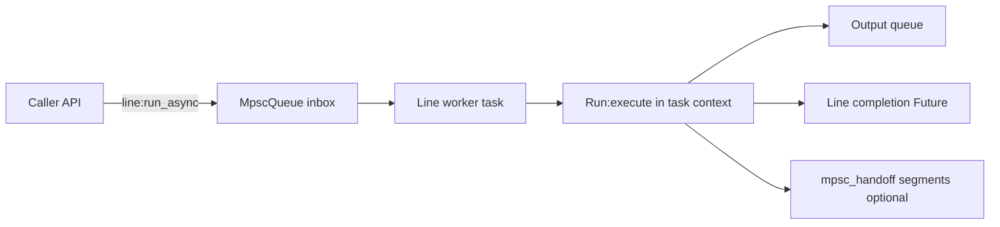

# Re-Async Discovery

This note captures how to move pipe-line to an async-first runtime built directly on coop tasks/futures, and remove blocking wait patterns from runtime modules.

Related local code:
- [`/lua/pipe-line/done.lua`](/lua/pipe-line/done.lua)
- [`/lua/pipe-line/line.lua`](/lua/pipe-line/line.lua)
- [`/lua/pipe-line/run.lua`](/lua/pipe-line/run.lua)
- [`/lua/pipe-line/coop.lua`](/lua/pipe-line/coop.lua)
- [`/lua/pipe-line/consumer.lua`](/lua/pipe-line/consumer.lua)
- [`/lua/pipe-line/outputter.lua`](/lua/pipe-line/outputter.lua)
- [`/lua/pipe-line/segment/mpsc.lua`](/lua/pipe-line/segment/mpsc.lua)

Primary coop references:
- [`gregorias/coop.nvim` `lua/coop/future.lua`](https://github.com/gregorias/coop.nvim/blob/main/lua/coop/future.lua#L70-L191)
- [`gregorias/coop.nvim` `lua/coop/control.lua`](https://github.com/gregorias/coop.nvim/blob/main/lua/coop/control.lua#L22-L249)
- [`gregorias/coop.nvim` `lua/coop/task.lua`](https://github.com/gregorias/coop.nvim/blob/main/lua/coop/task.lua#L29-L200)
- [`gregorias/coop.nvim` `lua/coop/mpsc-queue.lua`](https://github.com/gregorias/coop.nvim/blob/main/lua/coop/mpsc-queue.lua#L1-L93)
- [`~/wiki/gregorias/coop.nvim/3.2-awaiting-results`](/home/rektide/wiki/gregorias/coop.nvim/3.2-awaiting-results)
- [`~/wiki/gregorias/coop.nvim/4.1-parallel-execution`](/home/rektide/wiki/gregorias/coop.nvim/4.1-parallel-execution)

## Core conclusions

- `done.create_deferred()` is a custom primitive that duplicates coop Future behavior and currently embeds blocking (`vim.wait`) in runtime path.
- Runtime should not use `await(timeout, interval)` or `vim.wait`; those are synchronous escape hatches.
- The system should enter task context at ingress, then stay in task context through run execution and lifecycle handling.
- `mpsc_handoff` is useful as an explicit downstream boundary, but it is not by itself a full async-first ingress strategy.

## Current blocking map

Runtime blocking points today:

| File | Location | Blocking behavior |
|---|---|---|
| [`/lua/pipe-line/done.lua`](/lua/pipe-line/done.lua) | `create_deferred().await` | `vim.wait(...)` busy wait |
| [`/lua/pipe-line/coop.lua`](/lua/pipe-line/coop.lua) | `await_all` fallback | `task:await(timeout, interval)` |
| [`/lua/pipe-line/consumer.lua`](/lua/pipe-line/consumer.lua) | `await_task_stopped` | `task:await(timeout, interval)` |
| [`/lua/pipe-line/outputter.lua`](/lua/pipe-line/outputter.lua) | `await_task_stopped` | `task:await(timeout, interval)` |

## Coop model to follow

From coop semantics:

- Inside a task:
  - `future:await()` is a task function (yield/resume), non-busy.
  - `future:pawait()` returns `(ok, result)` and is preferred for explicit error/cancel flow.
  - `coop.control.gather(...)` and `coop.control.await_all(...)` are task-context operators.
- Outside a task:
  - use `future:await(callback)` (non-blocking callback mode).
  - avoid `await(timeout, interval)` except as explicit sync fallback tooling.

Policy target for pipe-line runtime:

- Allowed in runtime internals: task await (`await()`), protected await (`pawait()`), callback await (`await(cb)`).
- Disallowed in runtime internals: `vim.wait`, `await(timeout, interval)`.

## Initialization assessment ("get async earlier")

Current entry flow is synchronous:

- `pipe-line(config)` creates a line.
- `line:log(...)` calls `line:run(...)`.
- `Run.new(..., noStart=false)` executes `run:execute()` immediately on caller thread.

This means code is not in task context at ingress.

`mpsc_handoff` can move continuation into task context later, but only after sync entry and only where boundary segments are present. If the goal is "always safe to await in runtime internals", we need task context before regular run execution starts.

## Recommended architecture

Use a line ingress queue worker by default, and keep explicit boundary segments for additional async partitioning.

Why this is the right "async as fast as possible" move:

- task context starts at ingress, not mid-pipeline.
- all internal joins can use `await()/pawait()` and `coop.control` directly.
- no need for runtime busy-wait loops.
- explicit boundary segments still express extra queue boundaries where needed.

## Module-level refactor plan

### 1) Futures and lifecycle primitives

- Replace custom deferred internals with coop Future semantics.
- Prefer removing bespoke deferred behavior instead of expanding it.
- Either:
  - replace usages with raw `Future.new()`, or
  - keep `done.lua` as a tiny compatibility facade over `Future` with no timeout await path.

Key point: no `vim.wait` in runtime lifecycle primitives.

### 2) Line ingress and run execution

- Add async ingress API (for example `line:run_async(config)`), returning a Future/Task handle.
- Ensure a line worker task owns execution of `Run:execute()`.
- Keep message order by using single-consumer inbox semantics.

### 3) Join points and wait helpers

- Move join logic into task context and use `coop.control.gather` / `coop.control.await_all`.
- Replace timeout-await fallbacks in runtime modules with:
  - callback await at non-task boundaries,
  - task await/pawait inside worker/lifecycle tasks.

### 4) Consumer/outputter lifecycle

- Normalize on async lifecycle APIs returning awaitables.
- `stop` should cancel and return an awaitable (or schedule callback completion), not block.

### 5) mpsc boundary role

- Keep [`/lua/pipe-line/segment/mpsc.lua`](/lua/pipe-line/segment/mpsc.lua) for explicit boundaries.
- Do not rely on explicit boundary placement as the only mechanism for "getting into task".
- Ingress worker is the default task entry; boundary segments become explicit partitioning tools.

## "Start with mpsc every time" options

### Option A: Inject `mpsc_handoff` at pipe start

- Pros: minimal concept drift from existing boundary model.
- Cons: still sync at ingress callsite; couples async strategy to pipe shape; less direct than worker ingress.

### Option B: Default line inbox worker (recommended)

- Pros: async begins immediately; clearer ownership; less implicit pipe mutation.
- Cons: API surface changes around run/close semantics.

### Option C: Both

- Use worker ingress always, keep explicit handoff segments for additional boundaries.
- This gives early task context and still preserves visible boundary design.

## Suggested migration sequence

1. Introduce ingress worker and `run_async` path.
2. Convert line lifecycle (`ensure_prepared`, `ensure_stopped`, `close`) to async-first return handles.
3. Replace `done` internals with Future-backed behavior, removing `vim.wait`.
4. Remove runtime timeout-await patterns in `coop.lua`, `consumer.lua`, and `outputter.lua`.
5. Remove or shrink [`/lua/pipe-line/coop.lua`](/lua/pipe-line/coop.lua) once callsites use coop control primitives directly.

## Success criteria

- No `vim.wait` in runtime modules under [`/lua/pipe-line`](/lua/pipe-line).
- No runtime `await(timeout, interval)` usage.
- Runtime joins happen via task await/pawait or callback await.
- Line execution enters task context at ingress by default.
- Explicit queue boundary segments remain available for domain-level partitioning.

## Open design questions

- How strict should API breakage be for `line:run`/`line:close` return types?
- Should `done.lua` remain as a compatibility shim or be removed entirely?
- Should `line.done` and `line.stopped` remain separate futures, or be unified with structured result payloads?
