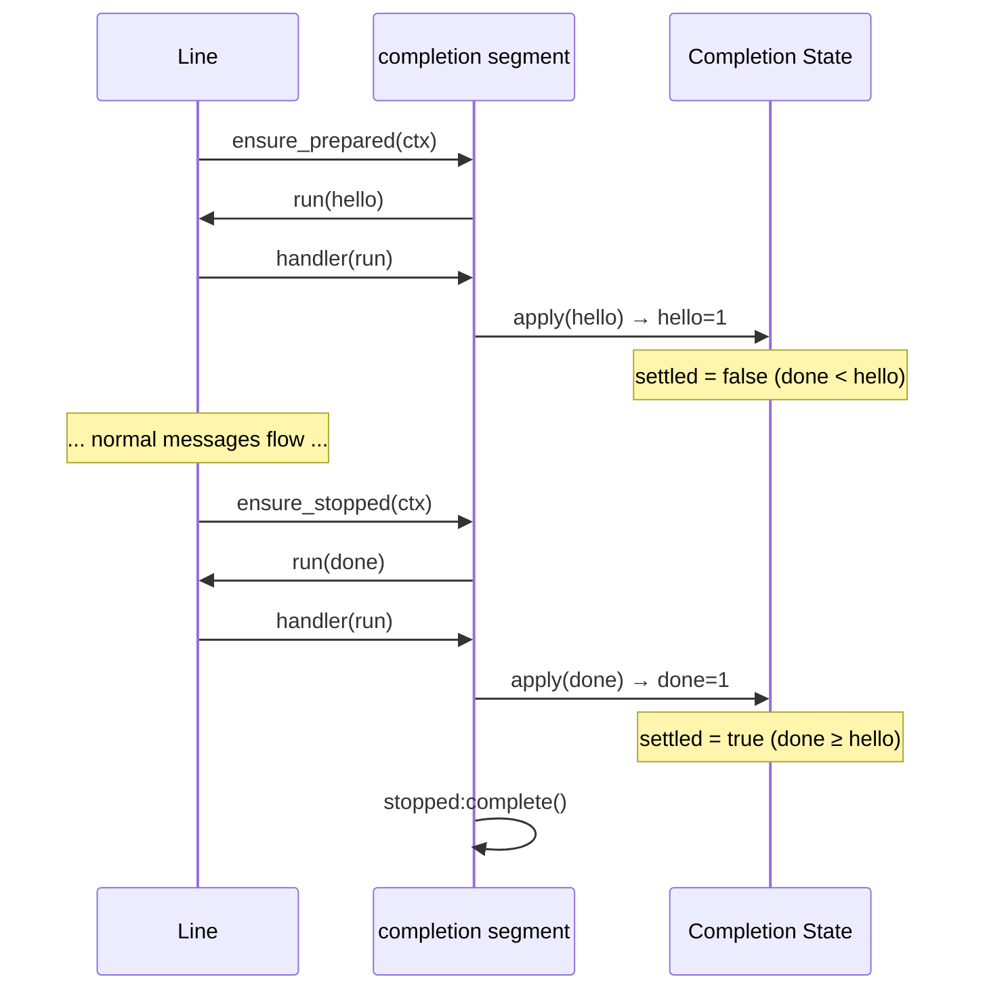

# Completion Protocol

This guide covers completion control runs and completion segment stop behavior.

References:
- [`/lua/pipe-line/protocol.lua`](/lua/pipe-line/protocol.lua)
- [`/lua/pipe-line/segment/completion.lua`](/lua/pipe-line/segment/completion.lua)
- [`/lua/pipe-line/line.lua`](/lua/pipe-line/line.lua)
- [`/doc/selecting.md`](/doc/selecting.md)

## Control Fields

Completion protocol uses run fields, not `run.input` payload fields:

- `pipe_line_protocol = true`
- `mpsc_completion = "hello" | "done" | "shutdown"`
- `mpsc_completion_name` optional

## Creating Control Runs

```lua
local protocol = require("pipe-line.protocol")

local hello = protocol.completion.completion_run("hello", "worker:a")
local done = protocol.completion.completion_run("done", "worker:a")

app:run(hello)
app:run(done)
```

## Completion State

Completion accounting is represented by a state table (`hello`, `done`, `settled`, last `signal`, last `name`).

`protocol.completion.apply(state, run)` mutates state in place and lazily initializes counters,
so callers can pass `{}`.

```lua
local state = {}
protocol.completion.apply(state, hello)
protocol.completion.apply(state, done)

if state.settled then
  -- done >= hello
end
```

## Completion Segment Stop

The built-in `completion` segment keeps its own `segment.stopped` deferred.

- `ensure_prepared` emits one `hello` control run for the line.
- `ensure_stopped` emits one `done` control run unless `line.auto_completion_done_on_close == false`.
- the segment resolves `segment.stopped` when completion accounting is settled.



Use selector-based waiting when you want completion-segment shutdown state:

```lua
local completion_stopped = app:stopped_live("completion")
app:close()
completion_stopped:await(1000, 10)
```
