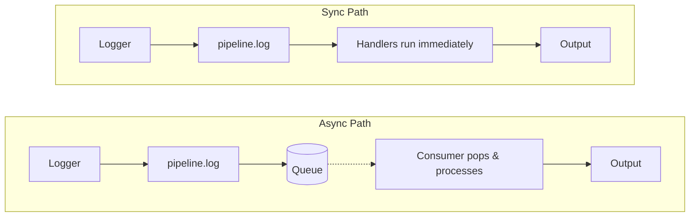
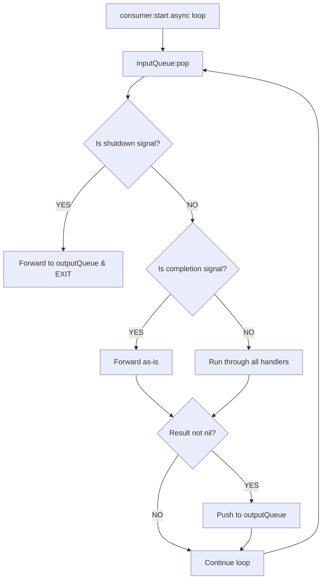
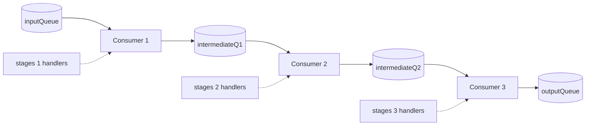

# Consumer Module Guide

The consumer module (`termichatter.consumer`) is the async workhorse of termichatter. It bridges the gap between queues and processing—taking messages that have been pushed to queues and running them through handlers.

## Table of Contents

- [Where Consumers Fit in the Architecture](#where-consumers-fit-in-the-architecture)
- [The Core Problem Consumers Solve](#the-core-problem-consumers-solve)
- [Message Flow Through a Consumer](#message-flow-through-a-consumer)
- [API Reference](#api-reference)
  - [create()](#create)
  - [createPipeline()](#createpipeline)
  - [withDriver()](#withdriver)
- [Patterns and Recipes](#patterns-and-recipes)

## Where Consumers Fit in the Architecture

termichatter has two execution modes for pipeline stages:

```
┌─────────────────────────────────────────────────────────────────┐
│                        SYNC PATH                                │
│  Logger → pipeline.log() runs handlers immediately, in-thread  │
└─────────────────────────────────────────────────────────────────┘

┌─────────────────────────────────────────────────────────────────┐
│                       ASYNC PATH                                │
│  Logger → pipeline.log() pushes to queue → CONSUMER pops       │
│           and processes → pushes to next queue or outputQueue  │
└─────────────────────────────────────────────────────────────────┘
```



**Consumers are the async path.** When `pipeline.log()` encounters a queue at a pipeline stage, it pushes the message and returns immediately. Something needs to pop that message and continue processing—that's what consumers do.

Without consumers, messages pushed to async queues would sit there forever.

## The Core Problem Consumers Solve

Imagine you have a logging pipeline with an expensive operation (network call, disk write, complex transformation). You don't want `log.info("hello")` to block while that happens.

**Without async (blocking):**
```
log.info() → timestamper → enricher → SLOW_NETWORK_CALL → output
            ↑                                            ↑
            └── caller blocked for entire duration ──────┘
```

**With async (non-blocking):**
```
log.info() → timestamper → enricher → [push to queue] → return immediately
                                            ↓
                              [Consumer running in background]
                                            ↓
                              SLOW_NETWORK_CALL → output
```

The caller returns instantly. The consumer handles the slow work in the background using coop.nvim's cooperative multitasking.

## Message Flow Through a Consumer

Here's what happens inside a consumer, step by step:

```
                    ┌─────────────────────────────────────┐
                    │         consumer:start()            │
                    │         (async loop)                │
                    └─────────────────────────────────────┘
                                    │
                                    ▼
                    ┌─────────────────────────────────────┐
                    │     inputQueue:pop()                │
                    │     (blocks until message arrives)  │
                    └─────────────────────────────────────┘
                                    │
                                    ▼
                    ┌─────────────────────────────────────┐
                    │     Is it a shutdown signal?        │
                    │     (protocol.isShutdown)           │
                    └─────────────────────────────────────┘
                           │                    │
                          YES                  NO
                           │                    │
                           ▼                    ▼
                    ┌──────────────┐   ┌─────────────────────────┐
                    │ Forward to   │   │ Is it a completion      │
                    │ outputQueue  │   │ signal? (hello/done)    │
                    │ and EXIT     │   └─────────────────────────┘
                    └──────────────┘          │           │
                                            YES          NO
                                             │           │
                                             ▼           ▼
                                    ┌────────────┐  ┌─────────────────┐
                                    │ Forward    │  │ Run through     │
                                    │ as-is      │  │ all handlers    │
                                    └────────────┘  └─────────────────┘
                                             │           │
                                             └─────┬─────┘
                                                   ▼
                                    ┌─────────────────────────────────┐
                                    │ Push result to outputQueue      │
                                    │ (if result is not nil)          │
                                    └─────────────────────────────────┘
                                                   │
                                                   ▼
                                            [Loop back to pop()]
```



### Key behaviors:

1. **Blocking pop**: `inputQueue:pop()` is a coop async operation—it yields until a message arrives. This is cooperative, not busy-waiting.

2. **Shutdown terminates**: When a `termichatter.shutdown` message arrives, the consumer forwards it and exits its loop. This is how pipelines cleanly shut down.

3. **Completion signals pass through**: `hello` and `done` messages are forwarded without processing. They're control messages, not data.

4. **Handlers can filter**: If a handler returns `nil`, the message is dropped (not forwarded).

5. **Results are forwarded**: Non-nil results go to `outputQueue` for the next stage or final output.

## API Reference

### create()

Creates a single consumer that processes messages from one queue.

```lua
local consumer = require("termichatter.consumer")

local c = consumer.create({
    inputQueue = myInputQueue,      -- Required: where to read messages
    handlers = { fn1, fn2, fn3 },   -- Optional: processing functions
    outputQueue = myOutputQueue,    -- Optional: where to send results
})
```

**Config options:**

| Field | Type | Description |
|-------|------|-------------|
| `inputQueue` | MpscQueue | Source queue to pop messages from |
| `handlers` | function[] | Array of `function(msg) -> msg or nil` |
| `outputQueue` | MpscQueue | Destination for processed messages |

**Returned consumer object:**

| Method | Description |
|--------|-------------|
| `c:start()` | Start the async consume loop (call from within a coop task) |
| `c:spawn()` | Spawn as a coop task, returns the Task object |
| `c:stop()` | Stop consuming and cancel the task |
| `c:process(msg)` | Run a message through handlers (sync, for testing) |
| `c:isRunning()` | Check if consumer loop is active |
| `c:addHandler(fn)` | Add a handler to the chain |

**Example: Basic consumer**

```lua
local coop = require("coop")
local MpscQueue = require("coop.mpsc-queue").MpscQueue
local consumer = require("termichatter.consumer")

local input = MpscQueue.new()
local output = MpscQueue.new()

local c = consumer.create({
    inputQueue = input,
    handlers = {
        function(msg)
            msg.processed = true
            return msg
        end,
    },
    outputQueue = output,
})

-- Start consuming in background
local task = c:spawn()

-- Push some messages
input:push({ data = "hello" })
input:push({ data = "world" })
input:push({ type = "termichatter.shutdown" })  -- Signal done

-- Wait for consumer to finish
task:await(1000, 10)

-- Collect results from output queue
```

### createPipeline()

Creates a chain of consumers connected by intermediate queues. Each stage is a separate consumer with its own handlers.

```lua
local pipeline = consumer.createPipeline(
    stages,       -- Array of { handlers: function[] }
    inputQueue,   -- First queue (entry point)
    outputQueue   -- Final queue (exit point)
)
```

**What it builds internally:**

```
inputQueue → [Consumer 1] → intermediateQ1 → [Consumer 2] → intermediateQ2 → [Consumer 3] → outputQueue
                  ↑                               ↑                               ↑
            stages[1].handlers            stages[2].handlers             stages[3].handlers
```



Each consumer runs as a separate coop task when you call `pipeline:start()`.

**Returned pipeline object:**

| Method | Description |
|--------|-------------|
| `pipeline:start()` | Spawn all consumers, returns array of Tasks |
| `pipeline:stop()` | Stop all consumers |
| `pipeline:push(msg)` | Push a message to the first queue |
| `pipeline:finish()` | Send shutdown signal to terminate pipeline |

**Example: Multi-stage processing**

```lua
local input = MpscQueue.new()
local output = MpscQueue.new()

local pipeline = consumer.createPipeline({
    -- Stage 1: Validation
    {
        handlers = {
            function(msg)
                if not msg.data then return nil end  -- Filter invalid
                return msg
            end,
        },
    },
    -- Stage 2: Enrichment
    {
        handlers = {
            function(msg)
                msg.enrichedAt = vim.uv.hrtime()
                return msg
            end,
        },
    },
    -- Stage 3: Formatting
    {
        handlers = {
            function(msg)
                msg.formatted = string.format("[%s] %s", msg.priority or "info", msg.data)
                return msg
            end,
        },
    },
}, input, output)

-- Start all stages
local tasks = pipeline:start()

-- Send messages
pipeline:push({ data = "hello", priority = "info" })
pipeline:push({ data = "world", priority = "debug" })
pipeline:push({ priority = "error" })  -- Will be filtered (no data)

-- Signal completion
pipeline:finish()

-- Wait for all stages to complete
for _, task in ipairs(tasks) do
    task:await(1000, 10)
end
```

### withDriver()

Wraps a consumer with a driver for scheduled execution. Drivers control when/how often the consumer runs.

```lua
local driven = consumer.withDriver({
    consumer = myConsumer,
    driver = myDriver,
})
```

This is useful when you want interval-based or adaptive scheduling rather than continuous consumption.

**Returned object:**

| Method | Description |
|--------|-------------|
| `driven:start()` | Spawn consumer and start driver |
| `driven:stop()` | Stop driver and consumer |

**Example: With interval driver**

```lua
local drivers = require("termichatter.drivers")
local consumer = require("termichatter.consumer")

local c = consumer.create({
    inputQueue = myQueue,
    handlers = { myHandler },
})

local driven = consumer.withDriver({
    consumer = c,
    driver = drivers.interval(100, function()
        -- Called every 100ms
        -- Could be used for batching, metrics, etc.
    end),
})

driven:start()
-- ... later
driven:stop()
```

## Patterns and Recipes

### Pattern: Fan-in (multiple producers, single consumer)

```lua
local sharedQueue = MpscQueue.new()

-- Multiple loggers push to the same queue
local logger1 = module1:baseLogger({})
local logger2 = module2:baseLogger({})

-- Single consumer processes all
local c = consumer.create({
    inputQueue = sharedQueue,
    handlers = { writeToFile },
})
c:spawn()
```

### Pattern: Filter chain

```lua
local pipeline = consumer.createPipeline({
    { handlers = { dropDebugInProduction } },
    { handlers = { dropSensitiveFields } },
    { handlers = { rateLimit } },
    { handlers = { formatForOutput } },
}, input, output)
```

### Pattern: Async transformation with error handling

```lua
local c = consumer.create({
    inputQueue = input,
    handlers = {
        function(msg)
            local ok, result = pcall(expensiveTransform, msg)
            if not ok then
                msg.error = result
                msg.priority = "error"
            end
            return msg  -- Always forward, even errors
        end,
    },
    outputQueue = output,
})
```

### Pattern: Graceful shutdown with drain

```lua
-- Send shutdown and wait for processing to complete
pipeline:finish()

for _, task in ipairs(tasks) do
    local ok = pcall(function()
        task:await(5000, 10)  -- 5 second timeout
    end)
    if not ok then
        print("Consumer timed out, forcing stop")
        pipeline:stop()
    end
end
```

## Relationship to Other Modules

| Module | Relationship to Consumer |
|--------|-------------------------|
| `pipeline` | Creates queues that consumers read from; `pipeline.log()` pushes to queues |
| `outputters` | Often the final consumer in a chain; reads from `outputQueue` |
| `protocol` | Defines shutdown/completion signals that consumers recognize |
| `drivers` | Can be attached to consumers for scheduled execution |
| `processors` | Standalone processor classes that can also consume from queues (similar pattern) |

## Common Mistakes

1. **Forgetting to spawn**: Calling `c:start()` directly instead of `c:spawn()` will block. Use `spawn()` or wrap in `coop.spawn()`.

2. **Not sending shutdown**: Without a shutdown signal, consumers run forever waiting for messages.

3. **Handler returns nothing**: Forgetting to `return msg` from a handler drops all messages.

4. **Queue mismatch**: Make sure the consumer's `inputQueue` matches where messages are being pushed.
