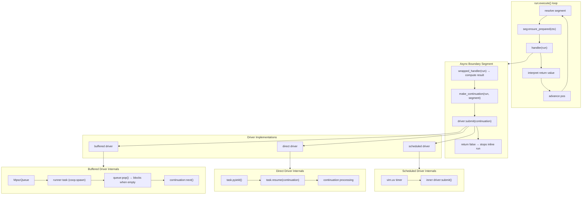
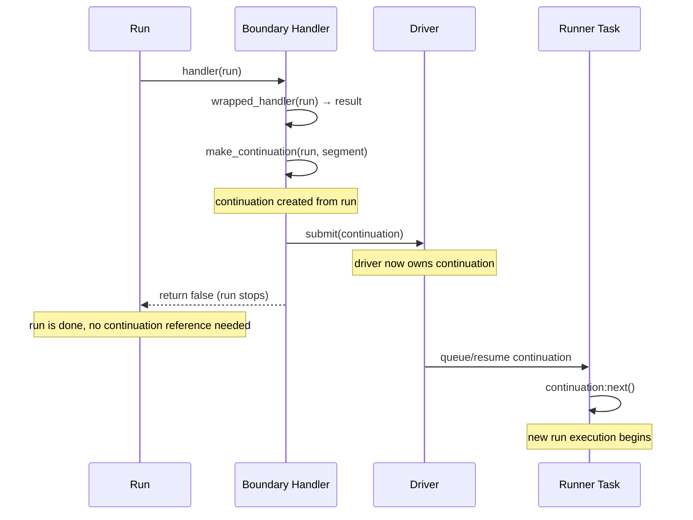

# Async Architecture v3: Driver-Centric Unification

> Status: Discovery  
> Date: 2026-03-16

This document proposes a unified async architecture for pipe-line, replacing the current transport policy layer with a narrower **driver** contract. It consolidates three async modes (mpsc, safe-task, unsafe-task) into two real semantics, integrates timer/scheduling into the same model, and clarifies continuation ownership.

## Reference Materials

| Area | Source | Why it matters |
|------|--------|----------------|
| Current transport composition | [`/lua/pipe-line/segment/define/transport.lua`](/lua/pipe-line/segment/define/transport.lua) | The abstraction being replaced |
| MPSC transport policy | [`/lua/pipe-line/segment/define/transport/mpsc.lua`](/lua/pipe-line/segment/define/transport/mpsc.lua) | Queue-based boundary implementation |
| Task transport policy | [`/lua/pipe-line/segment/define/transport/task.lua`](/lua/pipe-line/segment/define/transport/task.lua) | Safe and unsafe task runner implementations |
| Consumer module | [`/lua/pipe-line/consumer.lua`](/lua/pipe-line/consumer.lua) | Queue drain lifecycle (to be folded into driver) |
| Driver utility | [`/lua/pipe-line/driver.lua`](/lua/pipe-line/driver.lua) | Timer scheduling utility (to be integrated) |
| MPSC segment entry | [`/lua/pipe-line/segment/mpsc.lua`](/lua/pipe-line/segment/mpsc.lua) | Current mpsc_handoff segment |
| Run execution | [`/lua/pipe-line/run.lua`](/lua/pipe-line/run.lua) | Core execution loop and handler return semantics |
| Line lifecycle | [`/lua/pipe-line/line.lua`](/lua/pipe-line/line.lua) | Lifecycle orchestration context |
| Common define helpers | [`/lua/pipe-line/segment/define/common.lua`](/lua/pipe-line/segment/define/common.lua) | Shared utilities for transport wrappers |
| Segment contract | [`/doc/segment.md`](/doc/segment.md) | Handler return semantics and lifecycle hooks |
| Run contract | [`/doc/run.md`](/doc/run.md) | Continuation and execution semantics |
| Transport ADR | [`/doc/adr/adr-transport-policy-interface.md`](/doc/adr/adr-transport-policy-interface.md) | Handler-first transport contract (superseded by this proposal) |
| Stop strategy ADR | [`/doc/adr/adr-stop-drain-and-cancel-signal.md`](/doc/adr/adr-stop-drain-and-cancel-signal.md) | Drain/cancel stop semantics (preserved) |
| Boundary segments ADR | [`/doc/discovery/adr-async-boundary-segments.md`](/doc/discovery/adr-async-boundary-segments.md) | Explicit boundaries in pipe (preserved) |
| Driver-as-segment discovery | [`/doc/discovery/driver.md`](/doc/discovery/driver.md) | Earlier driver integration exploration |
| Transport layer history | [`/doc/archive/safe-task.md`](/doc/archive/safe-task.md) | Full chronology of transport design and simplification attempt |
| coop.nvim Task | [`~/archive/gregorias/coop.nvim/lua/coop/task.lua`](https://github.com/gregorias/coop.nvim/blob/main/lua/coop/task.lua) | Coroutine task with Future, cancel, pyield |
| coop.nvim Future | [`~/archive/gregorias/coop.nvim/lua/coop/future.lua`](https://github.com/gregorias/coop.nvim/blob/main/lua/coop/future.lua) | Completion primitive with await/pawait/callback |
| coop.nvim MpscQueue | [`~/archive/gregorias/coop.nvim/lua/coop/mpsc-queue.lua`](https://github.com/gregorias/coop.nvim/blob/main/lua/coop/mpsc-queue.lua) | Blocking pop, non-blocking push, wake-on-push |

## Problem Statement

The current async layer has three overlapping abstractions with uneven integration:

1. **Transport policy** (`segment/define/transport.lua` + per-transport implementations) — generic wrapper composing `ensure_prepared`/`handler`/`ensure_stopped` onto segments. Three implementations exist: mpsc, safe-task, unsafe-task.

2. **Consumer** (`consumer.lua`) — manages coop tasks that drain MpscQueues. Tightly coupled to mpsc transport. Separate module with its own lifecycle surface (`start_consumer`, `stop_consumer`, `ensure_queue_consumer`).

3. **Driver** (`driver.lua`) — standalone timer utility (`interval`, `rescheduler`) providing `{ start, stop }`. Completely outside the segment model, no handler contract, no lifecycle hooks, no continuation semantics.

Understanding mpsc alone requires reading four files across three directories:

- `segment/mpsc.lua` — public API and segment entry
- `define/mpsc.lua` — wrapper composition
- `transport/mpsc.lua` — actual queue behavior
- `consumer.lua` — runtime loop

The transport abstraction controls handler execution, which makes it more powerful than necessary. Transport policies implement `handler(segment, run, runtime)` — they own the full handler path, not just the continuation handoff.

The safe-task transport maintains a hand-rolled `pending` list + `wake` Future + runner loop. This duplicates what `coop.MpscQueue` already provides: push wakes waiting consumer, pop blocks when empty.

An earlier simplification attempt ([`/doc/archive/safe-task.md`](/doc/archive/safe-task.md), Phase 10) designed but never landed: awaitable-aware `run:execute()`, `queue_driver` as plain segment, raw continuation push. The transport files and consumer module still exist unchanged.

## Diagnosis: Three Modes Are Really Two

The three current transports collapse into two distinct async behaviors:

| Current transport | Mechanism | Core behavior |
|-------------------|-----------|---------------|
| **mpsc** | MpscQueue push → consumer task pops → `continuation:next()` | Buffered handoff via queue |
| **safe-task** | Append to `pending` list → wake Future signals runner → runner processes pending | Buffered handoff via queue |
| **unsafe-task** | `task.pyield()` → `task.resume(continuation)` directly | Direct handoff via coroutine yield |

Safe-task is structurally identical to mpsc: both are "push item to buffer, signal runner, runner processes item." The difference is that mpsc uses `coop.MpscQueue` (a proper linked-list queue with blocking pop) while safe-task uses a hand-rolled array + Future. MpscQueue is strictly better: it's already tested, handles wake/block correctly, and is the canonical coop.nvim primitive.

The two real semantics:

| Mode | Mechanism | Characteristics |
|------|-----------|-----------------|
| **buffered** (default) | MpscQueue push/pop | Ordered, non-blocking push, blocking pop, decoupled producer/consumer, safe for multiple producers |
| **direct** (expert) | `task.pyield()`/`resume()` | Lowest overhead, tight producer-consumer coupling, single outstanding handoff |

## Proposal: Transport → Driver

Replace the transport policy abstraction with a narrower **driver** contract. The driver only knows one thing: accept a continuation and resume it later.

### Key Change: Driver Does Not Control Handler Execution

Current transport policy:

```lua
-- transport owns the full handler path
transport.handler = function(segment, run, runtime)
  local continuation = common.prepare_continuation(segment, run, runtime.wrapped_handler)
  -- transport-specific dispatch logic
  return common.stop_result_or_false(segment)
end
```

Proposed driver contract:

```lua
-- boundary wrapper calls handler, then submits continuation to driver
segment.handler = function(run)
  local result = wrapped_handler(run)
  if result == false then return false end
  if result ~= nil then run.input = result end

  local continuation = make_continuation(run, segment)
  driver:submit(continuation)
  return false
end
```

The boundary wrapper is uniform. The driver only receives a continuation and decides how to resume it. This is the core simplification: **handler execution stays in the segment, driver only handles continuation resumption.**

### Driver Contract

```lua
---@class Driver
---@field type string           -- driver identity ("buffered", "direct", "scheduled")
---@field submit function       -- accept continuation for later resumption
---@field ensure_prepared function  -- start runner/scheduler (idempotent)
---@field ensure_stopped function   -- stop runner/scheduler, return awaitable

{
  type = "buffered",

  --- Accept a continuation for later resumption.
  ---@param self Driver
  ---@param continuation table  -- run or run-like with :next() method
  submit = function(self, continuation) end,

  --- Start driver runtime (runner task, timer, etc). Idempotent.
  ---@param self Driver
  ---@param context table  -- { line, pos, segment }
  ---@return table|nil awaitable
  ensure_prepared = function(self, context) end,

  --- Stop driver runtime. Return awaitable for completion.
  ---@param self Driver
  ---@param context table  -- { line, pos, segment }
  ---@return table|nil awaitable
  ensure_stopped = function(self, context) end,
}
```

Compared to transport policy:

| Transport policy (current) | Driver (proposed) |
|----------------------------|-------------------|
| `handler(segment, run, runtime)` — owns handler execution | `submit(continuation)` — only accepts continuation |
| `ensure_prepared(segment, context, runtime)` | `ensure_prepared(context)` |
| `ensure_stopped(segment, context, runtime)` | `ensure_stopped(context)` |
| Receives `runtime.wrapped_handler` | Does not see handler at all |
| Transport controls continuation creation | Boundary wrapper creates continuation |

### Architecture Flow



## Driver Implementations

### Buffered Driver (Default)

The buffered driver uses `coop.MpscQueue` as its single queuing primitive. This subsumes both the current mpsc transport and the safe-task transport.

```lua
-- driver/buffered.lua
local coop = require("coop")
local MpscQueue = require("coop.mpsc-queue").MpscQueue

local function is_task_active(task)
  if not task then return false end
  if type(task.status) == "function" then
    return task:status() ~= "dead"
  end
  return true
end

local function create_runner(queue, processor)
  return coop.spawn(function()
    while true do
      local continuation = queue:pop()
      -- pop blocks (yields) when queue is empty
      -- pop throws on cancellation
      if processor then
        processor(continuation)
      elseif type(continuation.next) == "function" then
        continuation:next()
      end
    end
  end)
end

function M.buffered(config)
  config = config or {}
  local queue = config.queue or MpscQueue.new()
  local processor = config.processor
  local runner = nil

  return {
    type = "buffered",
    queue = queue, -- exposed for shared-queue / mpsc_handoff use

    submit = function(self, continuation)
      queue:push(continuation)
    end,

    ensure_prepared = function(self, context)
      if is_task_active(runner) then return runner end
      runner = create_runner(queue, processor)
      return runner
    end,

    ensure_stopped = function(self, context)
      if is_task_active(runner) then
        runner:cancel()
        return runner
      end
      return nil
    end,
  }
end
```

Two usage modes from the same implementation:

| Mode | Configuration | Effect |
|------|---------------|--------|
| **private queue** | `buffered()` | Internal queue + runner. Simple async boundary. |
| **shared queue** | `buffered({ queue = my_queue })` | External queue. Multiple producers fan-in. Current mpsc_handoff behavior. |

### Direct Driver (Expert)

The direct driver uses `task.pyield()`/`resume()` for lowest-overhead handoff. Single outstanding continuation only.

```lua
-- driver/direct.lua
local task = require("coop.task")

function M.direct(config)
  config = config or {}
  local processor = config.processor
  local runner = nil

  return {
    type = "direct",

    submit = function(self, continuation)
      if not is_task_active(runner) then
        error("direct driver: runner not active, cannot submit", 0)
      end
      runner:resume(continuation)
    end,

    ensure_prepared = function(self, context)
      if is_task_active(runner) then return runner end
      runner = task.create(function()
        while true do
          local ok, continuation = task.pyield()
          if not ok then return end
          if processor then
            processor(continuation)
          elseif type(continuation.next) == "function" then
            continuation:next()
          end
        end
      end)
      runner:resume() -- prime the coroutine to first pyield
      return runner
    end,

    ensure_stopped = function(self, context)
      if is_task_active(runner) then
        runner:cancel()
        return runner
      end
      return nil
    end,
  }
end
```

### Scheduled Driver (Composable Wrapper)

The scheduled driver wraps any driver with timer-based scheduling. This integrates current `driver.lua` timer utilities into the driver model.

```lua
-- driver/scheduled.lua

--- Delay each submission by a fixed interval.
function M.after(ms, inner_driver)
  return {
    type = "scheduled",

    submit = function(self, continuation)
      vim.defer_fn(function()
        inner_driver:submit(continuation)
      end, ms)
    end,

    ensure_prepared = function(self, context)
      return inner_driver:ensure_prepared(context)
    end,

    ensure_stopped = function(self, context)
      return inner_driver:ensure_stopped(context)
    end,
  }
end

--- Adaptive rescheduling driver (backoff on idle).
--- Wraps timer-based polling around an inner driver for periodic batch processing.
function M.rescheduler(config, inner_driver)
  -- ...timer lifecycle using vim.uv, delegates to inner_driver
end
```

Composition: timer decides **when**, inner driver decides **how**.

```lua
-- delay resume by 100ms, use buffered queue
drivers.after(100, drivers.buffered())

-- adaptive polling with backoff, use buffered queue
drivers.rescheduler({ interval = 50, backoff = 1.5 }, drivers.buffered())
```

## Async Boundary Builder

A single boundary builder replaces the current `segment/define/transport.lua` composition. It connects segment handler execution to driver submission.

```lua
-- segment/boundary.lua
local common = require("pipe-line.segment.define.common")

local function build_boundary(define, spec, driver)
  local segment = common.copy_spec(spec)
  local wrapped_handler = define.wrap_handler(segment, segment.handler)

  local user_ensure_prepared = segment.ensure_prepared
  local user_ensure_stopped = segment.ensure_stopped

  segment.ensure_prepared = function(self, context)
    local awaited = {}
    if type(user_ensure_prepared) == "function" then
      common.append_awaitable(awaited, user_ensure_prepared(self, context))
    end
    common.append_awaitable(awaited, driver:ensure_prepared(context))
    return common.compact_awaitables(awaited)
  end

  segment.handler = function(run)
    local result = wrapped_handler(run)
    if result == false then return false end
    if result ~= nil then run.input = result end

    local continuation
    if type(segment.continuation_for_run) == "function" then
      continuation = segment.continuation_for_run(run, segment)
    else
      continuation = util.continuation_for_strategy(
        run, segment.strategy, run.input,
        segment.continuation_owner or segment.type
      )
    end

    driver:submit(continuation)
    return common.stop_result_or_false(segment)
  end

  segment.ensure_stopped = function(self, context)
    local awaited = {}
    if type(user_ensure_stopped) == "function" then
      common.append_awaitable(awaited, user_ensure_stopped(self, context))
    end
    common.append_awaitable(awaited, driver:ensure_stopped(context))
    return common.compact_awaitables(awaited)
  end

  return segment
end
```

Usage:

```lua
-- mpsc_handoff becomes a preset
local boundary = require("pipe-line.segment.boundary")
local drivers = require("pipe-line.driver")

function M.mpsc_handoff(config)
  config = config or {}
  local queue = config.queue or MpscQueue.new()

  return boundary(define, {
    type = "mpsc_handoff",
    strategy = config.strategy or "self",
  }, drivers.buffered({ queue = queue }))
end

-- a simple private-queue boundary
function M.async_boundary(config)
  config = config or {}
  return boundary(define, {
    type = "async_boundary",
    strategy = config.strategy or "clone",
  }, drivers.buffered())
end
```

## Continuation Ownership

### Current: Run-Owned

Currently `run.continuation` is a single slot on the run, set by `common.prepare_continuation()`. The transport reads it back for dispatch.

### Proposed: Driver-Owned After Submit

After the boundary wrapper calls `driver:submit(continuation)`, the **driver owns the continuation**. The run's job ends when `handler` returns `false`.

Ownership timeline:



`run.continuation` should be removed or made debug-only. Reasons:

- Single slot doesn't scale mentally for fan-out, retries, or multiple outstanding resumptions
- After submit, the run is done — holding a reference invites accidental coupling
- The driver is the natural owner: it decides when and how to resume

If observability is needed, stamp metadata on the continuation itself:

```lua
continuation._debug_owner = segment.id or segment.type
continuation._debug_strategy = segment.strategy
```

## Envelope Elimination

### Current

mpsc transport wraps continuations in envelopes:

```lua
local payload = { [segment.handoff_field] = continuation }
segment.queue:push(payload)
```

Consumer unwraps:

```lua
local msg = queue:pop()
local continuation = msg[segment.HANDOFF_FIELD]
continuation:next()
```

### Proposed

Push continuations directly:

```lua
queue:push(continuation)
-- ...
local continuation = queue:pop()
continuation:next()
```

The envelope pattern was designed for metadata extensibility, but in practice no metadata is attached. If metadata is needed later, it belongs on the continuation object itself, not in a wrapper envelope.

## What Gets Deleted

| File | Reason |
|------|--------|
| `segment/define/transport.lua` | Replaced by `segment/boundary.lua` |
| `segment/define/transport/mpsc.lua` | Folded into buffered driver |
| `segment/define/transport/task.lua` | Safe-task → buffered driver; unsafe-task → direct driver |
| `segment/define/safe-task.lua` | Thin wrapper, no longer needed |
| `segment/define/task.lua` | Thin wrapper, no longer needed |
| `segment/define/mpsc.lua` | Thin wrapper, no longer needed |
| `consumer.lua` | Queue drain folded into buffered driver |

## What Gets Replaced

| Current | Replacement |
|---------|-------------|
| `segment/define/common.lua` | Retained, possibly trimmed (`prepare_continuation` moves into boundary builder) |
| `driver.lua` (timer utility) | `driver/scheduled.lua` (composable wrapper around any driver) |
| `segment/mpsc.lua` | Simplified to use boundary builder + buffered driver |

## What Stays Unchanged

| Component | Why |
|-----------|-----|
| `run.lua` execution loop | No changes to handler return semantics or execution algorithm |
| `segment/define.lua` | Protocol wrapping unchanged |
| `segment/completion.lua` | Completion protocol is orthogonal to transport |
| `line.lua` lifecycle | `ensure_prepared`/`ensure_stopped` orchestration unchanged |
| Explicit boundaries in pipe | ADR accepted, architecturally sound |
| `handler(run)` returns `false` to stop | Core contract preserved |
| `run:clone`/`run:fork`/`run:next()` | Continuation mechanics preserved |

## Target File Structure

```
lua/pipe-line/
  driver/
    init.lua          -- re-exports: buffered, direct, scheduled
    buffered.lua      -- MpscQueue-backed driver (subsumes mpsc + safe-task)
    direct.lua        -- pyield/resume driver (subsumes unsafe-task)
    scheduled.lua     -- timer wrapper (composes with any driver)
  segment/
    boundary.lua      -- generic async boundary builder
    mpsc.lua          -- thin preset: boundary + buffered({ queue = shared })
    completion.lua    -- unchanged
    define.lua        -- unchanged
    define/
      common.lua      -- retained, trimmed
  run.lua             -- unchanged
  line.lua            -- unchanged
  ...
```

## Migration Path

### Phase 1: Implement drivers

Create `driver/buffered.lua`, `driver/direct.lua`, `driver/scheduled.lua` with the contracts described above. These can coexist with current transport code during transition.

### Phase 2: Implement boundary builder

Create `segment/boundary.lua`. Wire it to use drivers. Verify with tests that behavior matches current transport wrapper output.

### Phase 3: Migrate mpsc_handoff

Rewrite `segment/mpsc.lua` to use `boundary()` + `drivers.buffered({ queue = ... })`. Remove envelope wrapping. Verify existing tests pass.

### Phase 4: Delete transport layer

Remove `segment/define/transport.lua`, `transport/mpsc.lua`, `transport/task.lua`, `safe-task.lua`, `task.lua`, `define/mpsc.lua`. Remove `consumer.lua`.

### Phase 5: Integrate timer scheduling

Replace `driver.lua` timer utility with `driver/scheduled.lua`. Update any code that uses `driver.interval()` or `driver.rescheduler()` to use the composable wrapper.

### Phase 6: Clean up continuation ownership

Remove `run.continuation` from `common.prepare_continuation`. Move continuation creation into boundary builder. Add debug metadata if needed.

## Design Decisions

### Why Not Awaitable-Aware run:execute()?

The earlier simplification attempt ([`/doc/archive/safe-task.md`](/doc/archive/safe-task.md), Phase 10) proposed making `run:execute()` detect awaitable returns and spawn tasks automatically. This approach:

- Overloads handler return semantics beyond `nil/value/false`
- Makes async behavior invisible in the pipe definition
- Still needs lifecycle management (runners, timers) somewhere
- Makes the core loop more magical and harder to reason about

Explicit boundaries are better: async behavior is visible in the pipe, lifecycle is explicit, and the core loop stays simple.

### Why MpscQueue Over Hand-Rolled Pending+Wake?

The safe-task transport maintains:

```lua
state.pending = {}       -- array of pending continuations
state.wake = Future.new() -- signal runner to check pending
state.waiting = false     -- flag: is runner idle?
```

`coop.MpscQueue` provides exactly the same semantics:

- `push()` is non-blocking, wakes waiting consumer
- `pop()` blocks (yields task) when empty, resumes when item arrives
- Linked-list, no array compaction needed

MpscQueue is tested, canonical, and simpler. No reason to maintain a parallel implementation.

### Why Driver Doesn't Control Handler Execution?

Current transport `handler(segment, run, runtime)` owns the full processing path. This makes the transport responsible for calling `runtime.wrapped_handler`, interpreting its result, creating the continuation, and dispatching it.

The proposed driver only receives an already-created continuation via `submit()`. This means:

- Boundary wrapper is uniform across all driver types
- Driver implementation is simpler (no handler/runtime coupling)
- Easier to reason about: handler computes, driver delivers
- Easier to test: driver tests don't need handler mocks

### Why Two Modes, Not Three?

The distinction between mpsc and safe-task is implementation detail, not semantic difference. Both are "buffered async handoff with ordered processing." The user-facing choice should be:

1. **Buffered** — safe, ordered, decoupled. Use this unless you have a reason not to.
2. **Direct** — fast, coupled, expert-only. Use when you need lowest overhead and can tolerate tight producer-consumer coordination.

Whether the buffer is a shared external queue or a private internal queue is a configuration option on the buffered driver, not a separate mode.

### Why Composable Timer Wrapper?

Current `driver.lua` provides `interval(ms, callback)` and `rescheduler(config, callback)`. These are useful but disconnected from the segment model.

Making timers composable wrappers around drivers means:

- Timer decides **when** to resume
- Inner driver decides **how** to resume
- Lifecycle (start/stop) composes naturally
- No separate API surface to learn

This also cleanly separates two timer use cases:

| Use case | Model |
|----------|-------|
| Delayed/scheduled continuation resume | Scheduled driver wrapping buffered/direct |
| Periodic new run creation (polling, heartbeat) | Not a driver concern — belongs in a source/producer segment |

## Risks and Guardrails

| Risk | Mitigation |
|------|------------|
| Direct driver misuse (multiple concurrent submits) | Error on submit when runner not suspended; document as expert-only |
| Shared queue lifecycle complexity | Buffered driver tracks its own runner; shared queue users must coordinate stop |
| Envelope removal breaks external consumers | Search for `HANDOFF_FIELD` usage; no external consumers exist currently |
| Timer lifecycle leaks | Scheduled driver delegates to inner driver's `ensure_stopped`; timer cleanup in wrapper |
| Stop strategy incomplete | Preserve stop strategy ADR; implement drain/immediate as driver-level concern |
| Migration breaks existing tests | Phase the migration; keep old code until new code passes same tests |

## Open Questions

1. **Should `common.lua` survive?** `copy_spec`, `is_task_active`, `append_awaitable`, `compact_awaitables` are useful utilities. `prepare_continuation` and `stop_result_or_false` move into boundary builder. The utility functions might better live in a general `driver/util.lua` or stay where they are.

2. **Should `processor` config on drivers be kept?** Both buffered and direct drivers accept an optional `processor` function that can wrap `continuation:next()`. This is useful for custom processing but adds API surface. Could be deferred.

3. **How should stop strategy interact with drivers?** The stop strategy ADR defines `stop_drain` and `stop_immediate`. These naturally map to driver behavior: buffered driver can drain its queue before stopping vs. cancel immediately. The driver contract should support both, but implementation can be incremental.

4. **Should `Line:addHandoff()` gain a driver parameter?** Currently creates mpsc_handoff. Could become `Line:addBoundary(driver?, config?)` for generality, keeping `addHandoff` as alias.

5. **Should there be a `drivers.none()` for testing?** A synchronous driver that calls `continuation:next()` immediately would be useful for tests that want boundary semantics without actual async.

## Relationship to Existing ADRs

| ADR | Status under this proposal |
|-----|---------------------------|
| [Async Boundary Segments](/doc/discovery/adr-async-boundary-segments.md) | **Preserved.** Explicit boundaries remain the chosen model. |
| [Transport Policy Interface](/doc/adr/adr-transport-policy-interface.md) | **Superseded.** Transport policy replaced by narrower driver contract. Handler-first principle preserved but applied differently: boundary wrapper calls handler, driver only receives continuation. |
| [Stop Drain and Cancel Signal](/doc/adr/adr-stop-drain-and-cancel-signal.md) | **Preserved.** Stop strategy applies to drivers. Buffered driver supports drain (finish queue) vs. immediate (cancel runner). |

## Summary

The current transport layer is architecturally sound but over-abstracted for the problem it solves. Three async modes are really two behaviors (buffered and direct). The safe-task pending+wake pattern duplicates MpscQueue. Consumer lifecycle is a leaky abstraction. Timer scheduling sits outside the model.

The proposed driver contract is narrower: `submit(continuation)` + lifecycle hooks. The boundary builder is uniform: handler computes, driver delivers. The result is fewer files, clearer ownership, and a composable model that naturally integrates timer scheduling.

```
Before:                          After:
segment/define/transport.lua     segment/boundary.lua
  transport/mpsc.lua             driver/buffered.lua
  transport/task.lua (×2 modes)  driver/direct.lua
  safe-task.lua                  driver/scheduled.lua
  task.lua
  mpsc.lua (define wrapper)
consumer.lua
driver.lua (standalone)

6-7 files, 3 abstractions    →  4 files, 1 abstraction + presets
```
