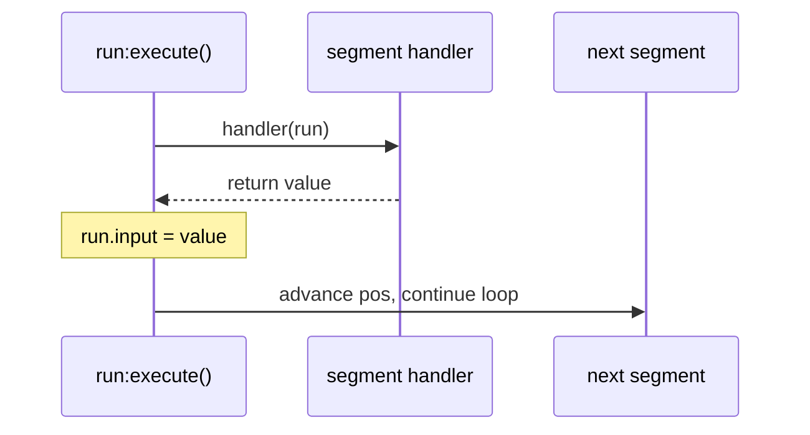
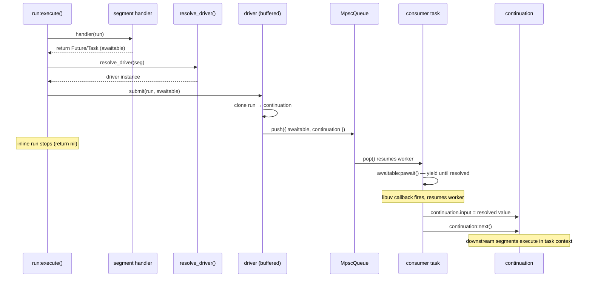
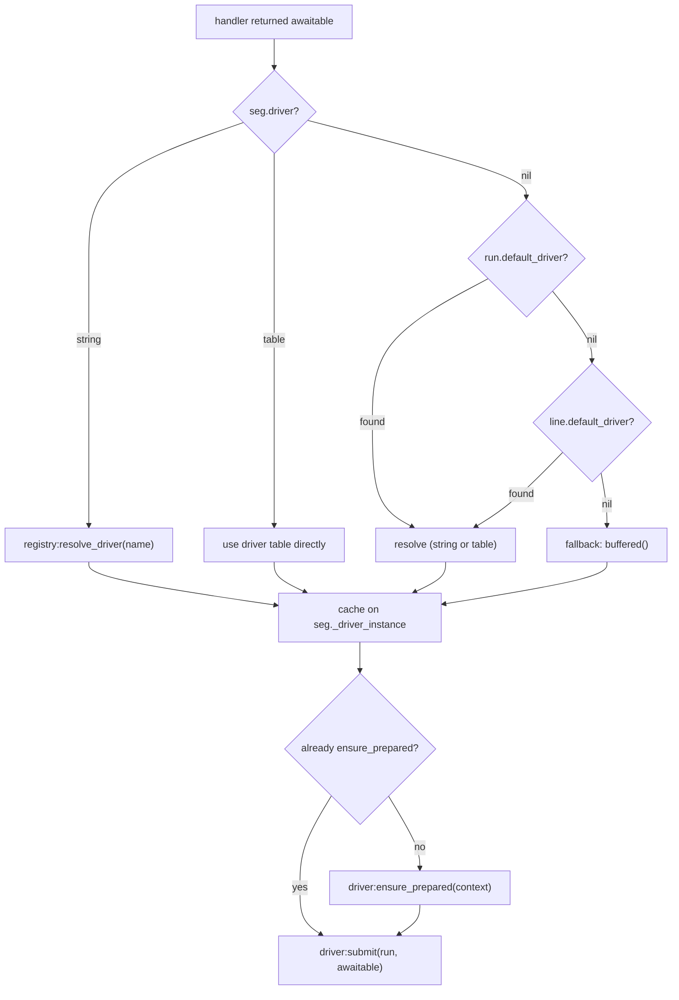
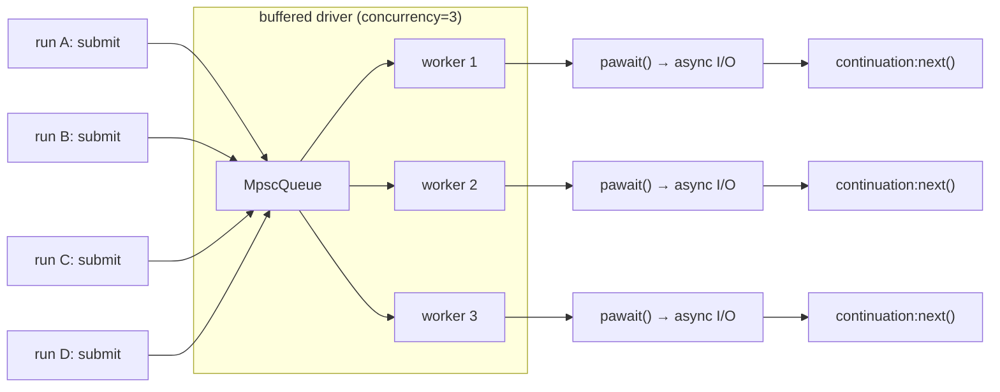

# Async Architecture v4: Implicit Drivers via Awaitable Detection

> Status: Discovery  
> Date: 2026-03-16  
> Supersedes: [async3.md](/doc/discovery/async3.md)

Async behavior emerges implicitly when a segment handler returns an awaitable. The runtime detects this, resolves a driver for the segment, and hands off continuation to a long-lived queue consumer. No explicit boundary segments in the pipe. Drivers are resolved by name from registry, configurable per-segment or per-line, and receive run context for shared configuration vocabulary.

## Reference Materials

| Area | Source | Why it matters |
|------|--------|----------------|
| Run execution loop | [`/lua/pipe-line/run.lua`](/lua/pipe-line/run.lua) | Where awaitable detection and driver handoff happen |
| Line lifecycle | [`/lua/pipe-line/line.lua`](/lua/pipe-line/line.lua) | `ensure_prepared` creates queues, `default_driver` lives here |
| Segment contract | [`/doc/segment.md`](/doc/segment.md) | Handler return semantics being extended |
| Registry resolution | [`/lua/pipe-line/registry.lua`](/lua/pipe-line/registry.lua) | Driver name resolution pattern |
| Current transport layer | [`/lua/pipe-line/segment/define/transport.lua`](/lua/pipe-line/segment/define/transport.lua) | Being replaced |
| Current consumer | [`/lua/pipe-line/consumer.lua`](/lua/pipe-line/consumer.lua) | Being folded into buffered driver |
| Current driver utility | [`/lua/pipe-line/driver.lua`](/lua/pipe-line/driver.lua) | Timer scheduling, being integrated |
| coop.nvim Task | [`~/archive/gregorias/coop.nvim/lua/coop/task.lua`](https://github.com/gregorias/coop.nvim/blob/main/lua/coop/task.lua) | Coroutine wrapper: create, resume, pyield, cancel |
| coop.nvim Future | [`~/archive/gregorias/coop.nvim/lua/coop/future.lua`](https://github.com/gregorias/coop.nvim/blob/main/lua/coop/future.lua) | Completion primitive: complete, await, pawait |
| coop.nvim MpscQueue | [`~/archive/gregorias/coop.nvim/lua/coop/mpsc-queue.lua`](https://github.com/gregorias/coop.nvim/blob/main/lua/coop/mpsc-queue.lua) | Blocking pop, non-blocking push, wake-on-push |
| coop.nvim uv wrappers | [`~/archive/gregorias/coop.nvim/lua/coop/uv.lua`](https://github.com/gregorias/coop.nvim/blob/main/lua/coop/uv.lua) | Async I/O task functions (fs_read, fs_open, etc.) |
| coop.nvim cb_to_tf | [`~/archive/gregorias/coop.nvim/lua/coop/task-utils.lua`](https://github.com/gregorias/coop.nvim/blob/main/lua/coop/task-utils.lua) | Callback-to-task-function conversion |
| coop.nvim control | [`~/archive/gregorias/coop.nvim/lua/coop/control.lua`](https://github.com/gregorias/coop.nvim/blob/main/lua/coop/control.lua) | await_all, await_any, gather, shield, timeout |
| Boundary segments ADR | [`/doc/discovery/adr-async-boundary-segments.md`](/doc/discovery/adr-async-boundary-segments.md) | Being superseded by implicit driver model |
| Transport ADR | [`/doc/adr/adr-transport-policy-interface.md`](/doc/adr/adr-transport-policy-interface.md) | Being superseded |
| Stop strategy ADR | [`/doc/adr/adr-stop-drain-and-cancel-signal.md`](/doc/adr/adr-stop-drain-and-cancel-signal.md) | Preserved, applies to driver stop behavior |
| Transport history | [`/doc/archive/safe-task.md`](/doc/archive/safe-task.md) | Full chronology of prior transport designs |
| async3 proposal | [`/doc/discovery/async3.md`](/doc/discovery/async3.md) | Prior iteration, explicit boundary + narrower driver contract |

## coop.nvim Primer

Understanding coop.nvim is essential to this design. There is no scheduler or event loop. Everything is explicit cooperative coroutine switching.

### Task

A Task wraps a Lua coroutine with a Future, cancel flag, and metatable methods.

```lua
local task = require("coop.task")
local t = task.create(function()
  -- this is the task body
  task.pyield()  -- yields the coroutine (coroutine.yield internally)
  return "done"
end)
-- nothing is running yet. the coroutine is created but suspended.
t:resume()     -- runs until first pyield(), then suspended again
t:resume()     -- continues from pyield, runs to completion
-- t.future is now complete with "done"
```

`task.create(fn)` = `coroutine.create(fn)` + Future + cancel flag. It does not run anything. `task:resume(...)` = `coroutine.resume(thread, ...)`. `task.pyield()` = `coroutine.yield()` with cancellation check.

`coop.spawn(fn)` = `task.create(fn)` + immediate `task:resume()`. The function runs synchronously until its first yield point. Cost: one coroutine stack allocation + one resume.

### Future

A Future is a callback list with a done flag.

```lua
local Future = require("coop.future").Future
local f = Future.new()  -- { done = false, queue = {} }

-- later:
f:complete("result")    -- sets done = true, fires all queued callbacks

-- awaiting (from within a task):
local val = f:await()   -- inserts resume-me callback, pyields, returns when complete
local ok, val = f:pawait()  -- protected version
```

`Future:complete(...)` fires callbacks synchronously. `Future:pawait()` from within a task: inserts a callback that resumes the current task, then pyields. When complete fires, the callback resumes the task. Ultra lightweight — just a callback list.

### MpscQueue

```lua
local MpscQueue = require("coop.mpsc-queue").MpscQueue
local q = MpscQueue.new()  -- { waiting = nil, head = nil, tail = nil }

-- push (non-blocking, any context):
q:push(value)
-- if a task is waiting on pop, push directly resumes that task with value
-- otherwise, appends to linked list

-- pop (blocks if empty, must be in task context):
local value = q:pop()
-- if queue has items: returns head, advances linked list
-- if empty: stores current task as self.waiting, pyields
-- when push arrives: resumes waiting task with value directly
```

Key properties:
- `push()` never blocks, never allocates a coroutine
- `pop()` blocks only when empty, by yielding the current task
- When a push wakes a waiting pop, the value goes directly from push to pop via `task:resume(value)` — no intermediate storage
- Single consumer only (one task can wait on pop at a time)

### Async I/O (coop.uv)

coop.uv wraps libuv functions as **task functions**. They can only be called from within a running Task.

```lua
local uv = require("coop.uv")
-- these must be called inside a task:
local err, fd = uv.fs_open(path, "r", 438)   -- yields until libuv callback fires
local err, data = uv.fs_read(fd, size)        -- yields until read completes
```

Internally: calls `vim.uv.fs_open` with a callback, then `task.pyield()`. When libuv fires the callback, it `vim.schedule_wrap`s it, which calls `task.resume(this)` to wake the suspended task.

**Critical constraint:** if code calls `coop.uv.fs_read()` outside a task, it errors: *"Called pyield outside of a running task."* This means any segment handler that does async I/O **must already be running in task context**.

### Cost Model

| Operation | Cost |
|-----------|------|
| `coop.spawn(fn)` | `coroutine.create()` (stack alloc) + `coroutine.resume()` — **per call** |
| `queue:push(val)` | Linked list append, or `task:resume(value)` if consumer waiting — **no allocation of coroutines** |
| `queue:pop()` | Return head, or `task.pyield()` if empty — **no allocation** |
| `Future.new()` | Table + metatable — **trivial** |
| `future:complete()` | Fire callbacks — **trivial** |

A long-lived consumer task (spawned once) doing `while true do local item = queue:pop(); process(item) end` costs one coroutine for the lifetime. Every message is just push + resume the existing coroutine. No new coroutines per message.

Spawning a new task per message costs a coroutine allocation per message. For high-throughput pipelines, this matters.

## Design

### Core Idea

When `handler(run)` returns an awaitable (Future or Task), `run:execute()` detects it and hands the continuation to a driver. The driver is resolved from the segment, falling back to run/line defaults. The driver owns a long-lived consumer task that provides both **task context** (so async I/O works) and **serialization** (so runs don't pile up).

No boundary segments. No transport wrappers. No envelope encoding. The pipe just lists the segments that do work:

```lua
pipe = { "timestamper", "file_reader", "cloudevent", "completion" }
```

If `file_reader` returns an awaitable, the runtime handles it.

### Awaitable Detection

An awaitable is a table with an `await` function:

```lua
local function is_awaitable(result)
  return type(result) == "table" and type(result.await) == "function"
end
```

This catches both `coop.Future` and `coop.Task` (which delegates await to its future).

### Extended Handler Return Semantics

| Handler return | Run behavior |
|----------------|--------------|
| `nil` | Keep current `run.input`, advance to next segment |
| non-`nil` value (not `false`, not awaitable) | Replace `run.input`, advance |
| `false` | Stop this run path immediately |
| **awaitable** (Future or Task) | **Hand off to driver, stop inline run** |

The awaitable case is the new addition. The run creates a continuation and submits it to the driver. The inline run stops. Later, the driver's consumer processes the continuation: it awaits the awaitable, applies the result, and calls `continuation:next()` to resume downstream execution.

### Driver Resolution

Drivers resolve through the same pattern as segments: string names go through registry, tables are used directly. Fallback chain provides defaults.

```
segment.driver → run.default_driver → line.default_driver
```

Resolution happens at the point where an awaitable is detected. The resolved driver is cached on the segment instance for subsequent runs.

```lua
-- in run:execute(), after detecting awaitable return:
local driver = self:resolve_driver(seg)
driver:submit(self, awaitable)
return  -- inline run stops
```

Resolution order:

1. `seg.driver` — per-segment override (string or table)
2. `run.default_driver` — per-run override (rare, but available via metatable)
3. `line.default_driver` — line-level default
4. Built-in fallback — `"buffered"` if nothing else specified

String values resolve through registry:

```lua
registry:register_driver("buffered", drivers.buffered)
registry:register_driver("direct", drivers.direct)
```

Or a shared registry namespace with a prefix convention. The resolution mechanism mirrors segment resolution.

### Driver Receives Run Context

The driver receives the full run when `submit` is called. This means driver behavior can be parameterized through run fields, using a **shared vocabulary** of `driver_*` options that any driver implementation can read:

| Run field | Meaning | Default |
|-----------|---------|---------|
| `run.driver_concurrency` | Max concurrent continuations for this driver | `1` |
| `run.driver_stop_type` | Stop strategy: `"drain"` or `"immediate"` | `"drain"` |

These fields are generic — not tied to a specific driver implementation. Any driver can read them. Because run metatables to line, setting `line.driver_concurrency = 3` applies to all runs unless overridden.

```lua
-- line-level default
local line = pipeline({ driver_concurrency = 3 })

-- segment-level override via fact or run config
run:set_fact("driver_concurrency", 1)  -- or just set on the run
```

### Driver Contract

```lua
---@class Driver
---@field type string
---@field submit function
---@field ensure_prepared function
---@field ensure_stopped function

{
  type = "buffered",

  --- Submit a continuation for async processing.
  --- Called by run:execute() when handler returns an awaitable.
  ---@param self Driver
  ---@param run table       -- the run context (full access to run.* and line.* via metatable)
  ---@param awaitable table -- the Future/Task returned by handler
  submit = function(self, run, awaitable) end,

  --- Start driver runtime (create queue, spawn consumer). Idempotent.
  --- Called during segment ensure_prepared lifecycle.
  ---@param self Driver
  ---@param context table   -- { line, pos, segment }
  ---@return table|nil awaitable
  ensure_prepared = function(self, context) end,

  --- Stop driver runtime. Return awaitable for completion.
  ---@param self Driver
  ---@param context table   -- { line, pos, segment }
  ---@return table|nil awaitable
  ensure_stopped = function(self, context) end,
}
```

Key difference from async3: `submit(self, run, awaitable)` receives the **run** (not a bare continuation) and the **awaitable** (the thing the handler returned). The driver creates the continuation itself and decides how to process it.

### Why the Driver Gets the Run

The run carries all context through its metatable chain: `run.input`, `run.line`, `run.driver_concurrency`, `run.fact`, etc. Rather than inventing a separate context parameter for every driver option, the run **is** the context. Drivers read whatever they need from it.

This also means the driver can use different strategies per-run if needed. A run with `driver_concurrency = 1` hitting a segment whose other runs have `driver_concurrency = 5` — the driver sees the specific run's value and can act accordingly. (In practice, concurrency is usually segment-wide, so the driver reads it once from the first run and caches it.)

### Automatic Queue Creation

Queues are created lazily. Two paths:

1. **`ensure_prepared` path** — when line lifecycle runs `ensure_prepared` for each segment, if the segment has a driver (explicit `seg.driver` field), the driver's `ensure_prepared` creates the queue and spawns the consumer. This is the normal startup path.

2. **First awaitable path** — if a segment has no explicit driver but its handler returns an awaitable, `run:execute()` resolves and instantiates a driver on the segment at that point. The driver creates its queue/consumer on first submit.

Control:

| Config | Effect |
|--------|--------|
| `auto_start_queues = true` (default) | `ensure_prepared` creates queue/consumer for segments with explicit driver |
| `auto_start_queues = false` | Skip automatic queue creation; queues created on first awaitable return |

### run:execute() Changes

The execution loop gains awaitable detection after handler invocation:

```lua
function Run:execute()
  self:sync()
  while self.pos <= #self.pipe do
    local seg = -- resolve segment (unchanged)

    if type(seg) == "table" and type(seg.ensure_prepared) == "function" then
      seg:ensure_prepared({ line = self.line, run = self, pos = self.pos, segment = seg })
    end

    local handler = self:resolve(seg)
    if handler then
      self.segment = seg
      local result = handler(self)
      self.segment = nil

      if result == false then
        return nil
      end

      -- NEW: awaitable detection
      if is_awaitable(result) then
        local driver = self:resolve_driver(seg)
        driver:submit(self, result)
        return nil  -- inline run stops, driver resumes later
      end

      if result ~= nil then
        self.input = result
      end
    end

    self.pos = self.pos + 1
    self:sync()
  end

  -- past end: push to output (unchanged)
  local output = rawget(self, "output") or (self.line and self.line.output)
  if output and self.input ~= nil then
    output:push(self.input)
  end
  return self.input
end
```

The `resolve_driver` method:

```lua
function Run:resolve_driver(seg)
  -- already resolved and cached on segment instance?
  if type(seg) == "table" and type(seg._driver_instance) == "table" then
    return seg._driver_instance
  end

  -- resolve from segment, then run/line defaults
  local driver_ref = (type(seg) == "table" and seg.driver)
    or self.default_driver
    or "buffered"

  local driver
  if type(driver_ref) == "string" then
    -- resolve from registry
    local registry = self.registry or (self.line and self.line.registry)
    if registry and registry.resolve_driver then
      driver = registry:resolve_driver(driver_ref)
    end
  elseif type(driver_ref) == "table" then
    driver = driver_ref
  end

  if not driver then
    driver = require("pipe-line.driver").buffered()
  end

  -- cache on segment instance
  if type(seg) == "table" then
    seg._driver_instance = driver
  end

  -- ensure started
  driver:ensure_prepared({ line = self.line, run = self, pos = self.pos, segment = seg })

  return driver
end
```

## Driver Implementations

### Buffered Driver (Default)

Uses `coop.MpscQueue` with a long-lived consumer task. Supports configurable concurrency.

```lua
local coop = require("coop")
local MpscQueue = require("coop.mpsc-queue").MpscQueue

local function is_task_active(task)
  if not task then return false end
  if type(task.status) == "function" then return task:status() ~= "dead" end
  return true
end

function M.buffered(config)
  config = config or {}
  local queue = config.queue or MpscQueue.new()
  local workers = {}
  local concurrency = nil  -- resolved from run context on first submit

  local function make_worker(process_fn)
    return coop.spawn(function()
      while true do
        local item = queue:pop()  -- blocks when empty
        process_fn(item)
      end
    end)
  end

  local function default_processor(item)
    local run = item.run
    local awaitable = item.awaitable
    local continuation = item.continuation

    -- await the async result (we're in task context, so this works)
    local ok, resolved = awaitable:pawait()
    if not ok then return end
    if resolved == false then return end
    if resolved ~= nil then
      continuation.input = resolved
    end

    continuation:next()
  end

  local function ensure_workers(target_concurrency)
    local process_fn = config.processor or default_processor

    -- prune dead workers
    local alive = {}
    for _, w in ipairs(workers) do
      if is_task_active(w) then
        table.insert(alive, w)
      end
    end
    workers = alive

    -- spawn up to target
    while #workers < target_concurrency do
      table.insert(workers, make_worker(process_fn))
    end
  end

  return {
    type = "buffered",
    queue = queue,

    submit = function(self, run, awaitable)
      -- resolve concurrency from run context (first time or per-submit)
      if concurrency == nil then
        concurrency = run.driver_concurrency or 1
      end
      ensure_workers(concurrency)

      -- create continuation from run
      local continuation = run:clone(run.input)
      continuation.pos = run.pos + 1

      queue:push({
        run = run,
        awaitable = awaitable,
        continuation = continuation,
      })
    end,

    ensure_prepared = function(self, context)
      local target = concurrency or 1
      ensure_workers(target)
      if #workers == 1 then return workers[1] end
      return workers
    end,

    ensure_stopped = function(self, context)
      local stopped = {}
      for _, w in ipairs(workers) do
        if is_task_active(w) then
          w:cancel()
          table.insert(stopped, w)
        end
      end
      workers = {}
      if #stopped == 0 then return nil end
      if #stopped == 1 then return stopped[1] end
      return stopped
    end,
  }
end
```

Concurrency behavior:

| `driver_concurrency` | Consumer behavior |
|---|---|
| `1` (default) | Single consumer task. Fully serialized. |
| `N` | N consumer tasks, all popping from same queue. Up to N concurrent awaitable resolutions. |

All workers share one MpscQueue. `pop()` is single-consumer in coop's implementation (only one task can wait), so for `N > 1`, only one worker is idle-waiting on pop at a time — the others are busy processing. When one finishes, it pops the next item. This is naturally correct because once a worker has an item, it processes it without contending on the queue.

**Note:** MpscQueue enforces single-consumer (`pop` errors if two tasks wait simultaneously). For `concurrency > 1`, the workers must take turns popping — only one blocks on pop at a time, the rest are busy processing their current item. If all workers are idle simultaneously, only one can wait. This limits practical concurrency patterns but is fine for the common case where work takes longer than dispatch.

For true multi-consumer needs, a different queue implementation or a dispatch-to-worker-channels approach would be needed. This is a future concern.

### Direct Driver (Expert)

Uses `task.pyield()`/`resume()` for lowest-overhead single-item handoff. No queue, no buffering.

```lua
function M.direct(config)
  config = config or {}
  local runner = nil

  return {
    type = "direct",

    submit = function(self, run, awaitable)
      if not is_task_active(runner) then
        error("direct driver: runner not active", 0)
      end

      local continuation = run:clone(run.input)
      continuation.pos = run.pos + 1

      runner:resume({ run = run, awaitable = awaitable, continuation = continuation })
    end,

    ensure_prepared = function(self, context)
      if is_task_active(runner) then return runner end
      local task = require("coop.task")
      runner = task.create(function()
        while true do
          local ok, item = task.pyield()
          if not ok then return end

          local resolved_ok, resolved = item.awaitable:pawait()
          if resolved_ok and resolved ~= false then
            if resolved ~= nil then
              item.continuation.input = resolved
            end
            item.continuation:next()
          end
        end
      end)
      runner:resume()  -- prime to first pyield
      return runner
    end,

    ensure_stopped = function(self, context)
      if is_task_active(runner) then
        runner:cancel()
        return runner
      end
      return nil
    end,
  }
end
```

Constraints:
- Single outstanding item (submit while processing blocks or errors)
- No buffering — if producer is faster than consumer, submit stalls
- Expert use only, for known-fast handlers where queue overhead is unwanted

### Scheduled Driver (Composable Wrapper)

Wraps any driver with timer-based delays. Timer decides **when**, inner driver decides **how**.

```lua
--- Delay each submission.
function M.after(ms, inner_driver)
  return {
    type = "scheduled",

    submit = function(self, run, awaitable)
      vim.defer_fn(function()
        inner_driver:submit(run, awaitable)
      end, ms)
    end,

    ensure_prepared = function(self, context)
      return inner_driver:ensure_prepared(context)
    end,

    ensure_stopped = function(self, context)
      -- TODO: cancel pending timers
      return inner_driver:ensure_stopped(context)
    end,
  }
end

--- Adaptive rescheduling with backoff.
function M.rescheduler(config, inner_driver)
  local base = config.interval or 50
  local backoff = config.backoff or 1.5
  local max = config.max_interval or 2000
  local timer = nil
  local current = base

  -- ... timer lifecycle wrapping inner_driver
end
```

## Flow Diagrams

### Normal Sync Segment



### Async Segment (Awaitable Return)



### Driver Resolution Chain



### Concurrency Model



With `driver_concurrency = 3`: up to 3 awaitables resolve concurrently. Run D waits in the queue until a worker finishes and pops it.

## Shared Driver Vocabulary

Drivers read configuration from the run context. Because run metatables to line, these options cascade naturally.

| Field | Type | Default | Meaning |
|-------|------|---------|---------|
| `driver_concurrency` | `number` | `1` | Max concurrent continuations the driver should process |
| `driver_stop_type` | `string` | `"drain"` | Stop strategy: `"drain"` (finish pending) or `"immediate"` (cancel) |

Set at any level:

```lua
-- line-level default: all segments allow 3 concurrent async operations
local line = pipeline({
  default_driver = "buffered",
  driver_concurrency = 3,
})

-- per-segment override
line:addSegment("slow_io", {
  driver = "buffered",
  driver_concurrency = 1,  -- serialize this one
  handler = function(run) ... end,
})

-- segment that declares no driver, but if handler returns awaitable,
-- runtime resolves from run.default_driver → line.default_driver
line:addSegment("maybe_async", {
  handler = function(run)
    if needs_io(run.input) then
      return coop.spawn(function()
        return do_io(run.input)
      end)
    end
    return transform(run.input)
  end,
})
```

The vocabulary is intentionally generic. Individual driver implementations may read additional fields, but `driver_concurrency` and `driver_stop_type` are the shared contract any driver should respect.

## Segment Authoring

### Before (Transport Wrapper Era)

```lua
-- segment needed transport wrapper, envelope encoding, boundary semantics
local mpsc_define = require("pipe-line.segment.define.mpsc")(define)
local my_segment = mpsc_define({
  type = "my_async_thing",
  strategy = "clone",
  handler = function(run)
    return do_work(run.input)
  end,
})
-- segment is now a boundary — pipe needs explicit placement
-- consumer.lua manages the queue lifecycle
-- handler return is intercepted by transport wrapper
```

### After (Implicit Driver)

```lua
-- segment just returns an awaitable when it does async work
registry:register("my_async_thing", {
  type = "my_async_thing",
  driver = "buffered",  -- optional: explicit driver choice
  handler = function(run)
    -- return a task that does async I/O
    return coop.spawn(function()
      local err, data = coop.uv.fs_read(fd, size)
      if err then return false end
      run.input.data = data
      return run.input
    end)
  end,
})
-- that's it. no wrapper, no envelope, no consumer management.
-- runtime detects awaitable, resolves driver, handles everything.
```

### Simplest Possible Async Segment

```lua
registry:register("file_reader", function(run)
  return coop.spawn(function()
    local err, fd = require("coop.uv").fs_open(run.input.path, "r", 438)
    if err then return false end
    local err2, data = require("coop.uv").fs_read(fd, 4096)
    require("coop.uv").fs_close(fd)
    if err2 then return false end
    run.input.content = data
    return run.input
  end)
end)
```

The handler spawns a task that does async file I/O and returns the task. The runtime detects it's an awaitable, hands it to the default buffered driver, and the consumer awaits the result then continues the pipeline.

The handler doesn't need to know about queues, continuations, consumers, or lifecycle. It just returns an awaitable.

## What Gets Deleted

| File | Reason |
|------|--------|
| `segment/define/transport.lua` | Transport composition layer replaced by awaitable detection in run |
| `segment/define/transport/mpsc.lua` | Folded into buffered driver |
| `segment/define/transport/task.lua` | Safe-task → buffered; unsafe-task → direct driver |
| `segment/define/safe-task.lua` | Wrapper, no longer needed |
| `segment/define/task.lua` | Wrapper, no longer needed |
| `segment/define/mpsc.lua` | Wrapper, no longer needed |
| `consumer.lua` | Queue drain folded into buffered driver |

## What Changes

| Component | Change |
|-----------|--------|
| `run.lua` | `execute()` gains awaitable detection + `resolve_driver()` |
| `segment/mpsc.lua` | Simplified: just a segment whose handler pushes to a queue and returns false. Or possibly deprecated entirely — a segment that wants shared-queue fan-in can expose its queue, and pushing to it is just `queue:push(continuation)` |
| `driver.lua` | Replaced by `driver/` directory with `buffered.lua`, `direct.lua`, `scheduled.lua` |
| `segment/define/common.lua` | Trimmed: `prepare_continuation` and `stop_result_or_false` no longer needed. Utility functions (`is_task_active`, `append_awaitable`, `compact_awaitables`) move to driver util or stay |
| `line.lua` | Gains `default_driver` field. `ensure_prepared` passes driver lifecycle. |

## What Stays Unchanged

| Component | Why |
|-----------|-----|
| `segment/define.lua` | Protocol wrapping unchanged |
| `segment/completion.lua` | Completion protocol orthogonal to driver model |
| Handler return semantics for `nil`/value/`false` | Extended, not changed |
| `run:clone`/`run:fork`/`run:next()` | Continuation mechanics preserved |
| `line:close()` / `ensure_stopped` lifecycle | Drivers participate through same lifecycle hooks |
| Registry pattern | Extended with driver resolution, not changed |

## Target File Structure

```
lua/pipe-line/
  driver/
    init.lua          -- re-exports: buffered, direct, scheduled
    buffered.lua      -- MpscQueue + worker pool
    direct.lua        -- pyield/resume expert mode
    scheduled.lua     -- timer wrapper (composes with any driver)
  segment/
    mpsc.lua          -- simplified or deprecated
    completion.lua    -- unchanged
    define.lua        -- unchanged
    define/
      common.lua      -- trimmed utilities
  run.lua             -- + awaitable detection, resolve_driver
  line.lua            -- + default_driver
  coop.lua            -- unchanged
  ...
```

## Relationship to Explicit Boundary Segments

The [ADR for async boundary segments](/doc/discovery/adr-async-boundary-segments.md) chose explicit `mpsc_handoff` entries in the pipe. This proposal **supersedes** that decision.

The boundary ADR's core concern was valid: async behavior should be visible and stable under pipe mutation. With implicit drivers, async behavior is still visible — the segment's handler returns an awaitable, and the segment can declare `driver = "buffered"` in its spec. But the pipe doesn't need a separate boundary entry.

What the pipe gains:

- Pipes are shorter and describe **what work happens**, not async plumbing
- No separate "handoff" concept to learn
- Segments are self-contained — a segment that does async I/O just returns an awaitable

What is lost:

- Pipe definition no longer shows where async boundaries are by looking at entries
- No explicit mpsc_handoff to grep for in pipe definitions
- Fan-in shared queue pattern needs a different expression (segment with explicit shared queue config)

The tradeoff favors simplicity. Async boundaries were an implementation detail elevated to API. Handlers that return awaitables are a natural extension of the existing return semantics.

## mpsc_handoff Under This Model

The shared-queue fan-in pattern (multiple producers pushing to one queue, one consumer popping) doesn't need a special segment type. It becomes a driver configuration:

```lua
local shared_queue = MpscQueue.new()

registry:register("stage_a", {
  driver = drivers.buffered({ queue = shared_queue }),
  handler = function(run) ... end,
})

registry:register("stage_b", {
  driver = drivers.buffered({ queue = shared_queue }),
  handler = function(run) ... end,
})
```

Or, if a segment specifically wants to stop the current run and push work to a shared queue (the old mpsc_handoff pattern), it can still return `false` explicitly:

```lua
handler = function(run)
  shared_queue:push(run:clone(run.input))
  return false
end
```

No special segment type needed. The queue is just data.

## Open Questions

1. **`run.continuation` field** — still needed? If the driver creates its own continuation from the run, the run doesn't need to track it. Probably remove or make debug-only.

2. **MpscQueue single-consumer limitation** — with `concurrency > 1`, multiple workers pop from the same queue. coop's MpscQueue errors if two tasks wait on pop simultaneously. Need to verify the "workers take turns popping" model works, or use a different queue for concurrent cases.

3. **Handler returning already-resolved awaitable** — if the Future is already done when the handler returns it, should the runtime still submit to driver, or fast-path inline? Optimization opportunity but adds complexity.

4. **Driver per-segment vs per-segment-instance** — with `auto_instance`, each line gets its own segment instance. The driver should be per-instance (cached on `seg._driver_instance`). Verify this works with the instancing model.

5. **Completion protocol interaction** — completion protocol uses control runs (protocol runs with `pipe_line_protocol = true`). These should pass through segments without triggering driver handoff. The `define.wrap_handler` protocol check already handles this — protocol runs that hit a wrapped handler get passed through before the handler's async return is reached.

6. **Error propagation** — if `awaitable:pawait()` returns an error, what happens? The continuation doesn't resume. Should the driver log the error? Propagate to line? Resolve a segment-level error future?

7. **Timer-based drivers and the new model** — `scheduled.lua` wraps timer delays around an inner driver. How does this interact with `ensure_prepared` / `auto_start_queues`? The inner driver needs preparation, the timer just adds delay to submit.
