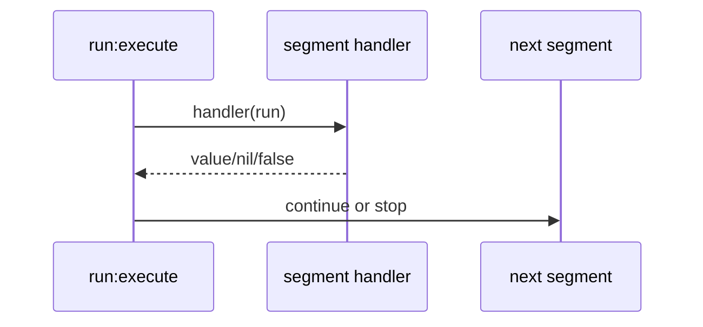
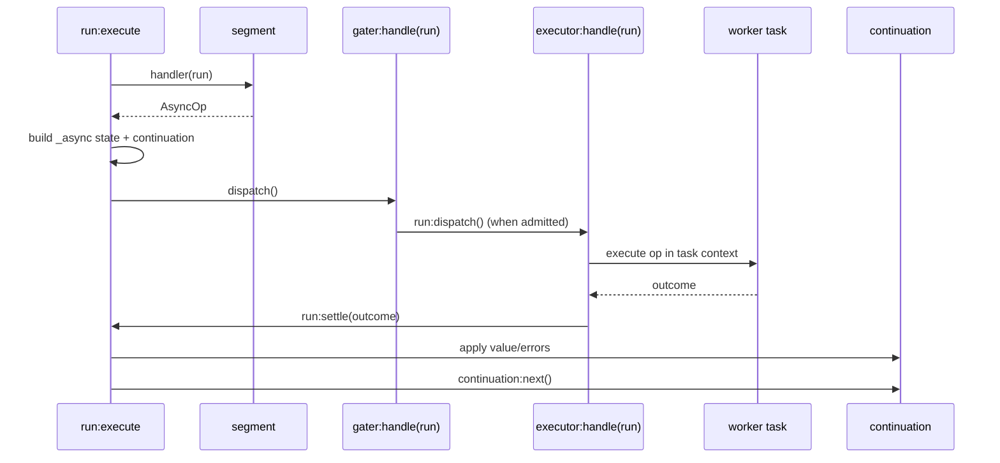

# Async Architecture v5: Segment-Owned Async Aspects

> Status: Discovery
> Date: 2026-03-16
> Supersedes: [async4.md](/doc/discovery/async4.md)
> Revises: [adr-async-boundary-segments.md](/doc/discovery/adr-async-boundary-segments.md)

This document defines the v5 async architecture for pipe-line.

v5 is a clean-slate redesign. Backward compatibility with explicit boundary segments and transport wrappers is not an objective.

## Executive Summary

- Async boundaries are implicit: a segment handler returns an AsyncOp.
- No explicit `mpsc_handoff` entries in the pipe.
- Async runtime mechanics are modeled as **segment-owned aspects**.
- `gater` and `executor` are both aspects, and both use `handle(run)`.
- Aspects are the single extension point for async lifecycle hooks.
- The run remains the one execution context; no separate `item` abstraction is introduced.
- `task_fn` AsyncOp is the preferred async authoring style (avoid per-message `coop.spawn(...)`).
- Default behavior forwards async errors as data to downstream segments.
- Stop policies remain explicit: `stop_drain` and `stop_immediate`.

## Why v5 Exists

Review of v4 identified two practical issues:

1. **Ingress and egress were mixed in one object.**
   - Admission/backpressure and async execution are different responsibilities.
   - They should be separate components with separate state and semantics.

2. **The authoring model still encouraged eager spawn.**
   - `coop.spawn(...)` inside handler allocates a coroutine per message.
   - That undermines the long-lived consumer optimization.

v5 keeps the good part of v4 (implicit async detection in run execution) while tightening architecture around segment aspects and deferred operations.

## Goals

1. Keep pipe definitions focused on business processing steps.
2. Make ingress throttling/backpressure explicit and optional.
3. Keep async execution in coop task context so `coop.uv` works naturally.
4. Preserve the run as the single self-contained context object.
5. Make lifecycle and stop behavior explicit and testable.
6. Make async failure behavior deterministic and observable.

## Non-goals

1. Preserve old boundary-segment API shape.
2. Keep transport wrappers as first-class architecture.
3. Support run-level async policy overrides through `fact`.
4. Claim unsupported multi-waiter queue behavior for coop MPSC queue.

## Reference Materials

| Area | Source | Why it matters |
|------|--------|----------------|
| Current run loop | [`/lua/pipe-line/run.lua`](/lua/pipe-line/run.lua) | Async detection insertion point |
| Current line lifecycle | [`/lua/pipe-line/line.lua`](/lua/pipe-line/line.lua) | where `ensure_prepared`/`ensure_stopped` run today |
| Current registry | [`/lua/pipe-line/registry.lua`](/lua/pipe-line/registry.lua) | named resolution conventions |
| Existing segment contract | [`/doc/segment.md`](/doc/segment.md) | base hook semantics |
| Async v4 proposal | [`/doc/discovery/async4.md`](/doc/discovery/async4.md) | predecessor and lessons |
| Boundary ADR | [`/doc/discovery/adr-async-boundary-segments.md`](/doc/discovery/adr-async-boundary-segments.md) | decision being replaced |
| Stop ADR | [`/doc/adr/adr-stop-drain-and-cancel-signal.md`](/doc/adr/adr-stop-drain-and-cancel-signal.md) | policy naming and intent |
| coop MPSC queue | [`gregorias/coop.nvim` `lua/coop/mpsc-queue.lua`](https://github.com/gregorias/coop.nvim/blob/main/lua/coop/mpsc-queue.lua) | single waiting consumer constraint |
| coop task | [`gregorias/coop.nvim` `lua/coop/task.lua`](https://github.com/gregorias/coop.nvim/blob/main/lua/coop/task.lua) | cancellation and task context |
| coop future | [`gregorias/coop.nvim` `lua/coop/future.lua`](https://github.com/gregorias/coop.nvim/blob/main/lua/coop/future.lua) | await and pawait semantics |
| coop uv | [`gregorias/coop.nvim` `lua/coop/uv.lua`](https://github.com/gregorias/coop.nvim/blob/main/lua/coop/uv.lua) | why async I/O must run inside task context |

## Core Design: Segment-Owned Aspects

v5 introduces a simple model:

- A segment may have an `aspects` array.
- `gater` and `executor` are just standard aspect instances in that array.
- Async dispatch walks the aspect chain using `run:dispatch()`.
- Each aspect handles the run via `aspect:handle(run)`.

This gives one consistent extension mechanism for lifecycle + data-plane behavior.

### Why this model

1. No special orchestration path for gate vs executor.
2. No new user-facing object beyond run.
3. Lifecycle is uniform: segment and aspects both expose the same hook names.
4. Optional gate becomes trivial: omit it, or use a no-op gater.

## Terminology

| Term | Meaning |
|------|---------|
| `AsyncOp` | async operation object returned by handler |
| `gater` | ingress aspect for admission, pending queue, overflow policy |
| `executor` | egress aspect that runs AsyncOp and settles result |
| `aspect` | segment subprocessor with lifecycle hooks and `handle(run)` |
| `settle` | finalize async outcome to continuation and continue downstream |

## Handler Return Contract

`handler(run)` returns one of:

| Return | Behavior |
|--------|----------|
| `nil` | keep input and continue inline |
| non-`nil` value (except `false`) | replace input and continue inline |
| `false` | stop run path |
| `AsyncOp` | initialize async state, dispatch aspects, stop inline run |

Sync semantics are unchanged. Async semantics are explicit and structured.

## AsyncOp API

v5 introduces [`/lua/pipe-line/async.lua`](/lua/pipe-line/async.lua).

### Constructors

```lua
local async = require("pipe-line.async")

-- preferred: deferred operation
return async.task_fn(function(ctx)
  local uv = require("coop.uv")
  local err, data = uv.fs_read(ctx.input.fd, 4096)
  if err then
    return async.fail({ code = "fs_read", message = err })
  end
  ctx.input.data = data
  return ctx.input
end)

-- supported: already-running awaitable
return async.awaitable(existing_task_or_future)
```

### Why `task_fn` is preferred

- Work starts only when executor runs it.
- Gating is meaningful (admission before execution).
- No per-message coroutine allocation in handler.

### Suggested AsyncOp shape

```lua
---@class AsyncOp
---@field kind 'task_fn'|'awaitable'
---@field fn? fun(ctx: table): any
---@field awaitable? table
---@field meta? table
```

## Run-Centric Async State

No separate async `item` object is introduced.

Instead, run gains an internal async namespace for one async handoff:

```lua
run._async = {
  segment = seg,
  op = async_op,
  continuation = continuation,
  aspects = seg._aspects,
  aspect_index = 0,
  settled = false,
  settle_cbs = {},
}
```

This state is runtime-internal. The run remains the single context object from user perspective.

### Runtime methods on run

```lua
run:dispatch()          -- invoke next aspect:handle(run)
run:on_settle(cb)       -- register async finalizer callback
run:settle(outcome)     -- exactly-once settle path
```

`run:settle(...)` applies outcome to continuation, runs settle callbacks, and then calls `continuation:next()`.

## Aspect Contract

Aspects use symmetric data-plane naming and shared lifecycle hooks.

```lua
---@class SegmentAspect
---@field type string
---@field role string|nil           -- e.g. 'gater', 'executor', 'metrics'
---@field handle fun(self, run: table): any
---@field init? fun(self, context: table): table|nil
---@field ensure_prepared? fun(self, context: table): table|nil
---@field ensure_stopped? fun(self, context: table): table|nil
```

Notes:

- `handle(run)` is required for active aspects in async chain.
- `ensure_prepared` is the canonical startup hook in v5.
- `ensure_started` is out of scope for v5 and should not be introduced in this iteration.

## Gater and Executor as Aspects

`gater` and `executor` are not special contracts; they are role-tagged aspects in `segment.aspects`.

### Gater behavior

- Owns admission state (`accepting`, `inflight`, `pending`).
- May dispatch immediately or enqueue.
- Registers settle callback to release permit and pump pending queue.
- Calls `run:dispatch()` when admitted.

### Executor behavior

- Owns execution runtime (queue workers or direct path).
- Executes `run._async.op` in task context.
- Calls `run:settle(outcome)` exactly once.

## Lifecycle Model with Aspects

Aspects are the one way a segment extends lifecycle participation.

### Aspect resolution

Segment instancing resolves and caches aspects on the segment instance:

- `seg._aspects`
- stable order for run dispatch

### Resolution order

Recommended chain:

1. segment-declared `aspects` entries (in declared order)
2. if no explicit `gater` present, inject resolved default gater
3. if no explicit `executor` present, inject resolved default executor

Default injection keeps common configuration simple while allowing explicit full control.

### Lifecycle orchestration

For each segment instance:

1. `segment:init(context)` then each `aspect:init(context)`
2. `segment:ensure_prepared(context)` then each `aspect:ensure_prepared(context)`
3. `segment:ensure_stopped(context)` then each `aspect:ensure_stopped(context)`

## Dispatch Semantics

### Core rule

Aspect chain advances only through `run:dispatch()`.

Pseudo implementation:

```lua
function Run:dispatch()
  local a = rawget(self, "_async")
  if not a then
    error("dispatch called without async state", 0)
  end

  a.aspect_index = a.aspect_index + 1
  local aspect = a.aspects[a.aspect_index]
  if not aspect then
    return nil
  end

  return aspect:handle(self)
end
```

This ensures one consistent control flow across all async aspects.

## Settlement Semantics

### Outcome shape

```lua
-- success
{ status = "ok", value = value_or_nil }

-- error
{ status = "error", error = { code = "...", message = "...", detail = ... } }
```

### Exactly-once requirement

`run:settle(...)` is idempotent. Second settle calls should be ignored and logged (or asserted in strict mode).

### Settle scope

Settle callbacks are scoped to this async handoff instance on this run encounter. They are not global run hooks.

## Continuation Invariant

Continuation cursor semantics are fixed to avoid off-by-one errors.

When async handoff occurs:

```lua
local continuation = run:clone(run.input)
continuation.pos = run.pos
```

Then settle path resumes with:

```lua
continuation:next()
```

This resumes exactly at downstream segment `run.pos + 1`.

## Configuration Model

Async policy is configured at segment or line scope.

No run-level policy overrides.

### Core line defaults

| Field | Default | Meaning |
|-------|---------|---------|
| `default_gater` | `"none"` | gater to inject when segment has none |
| `default_executor` | `"buffered"` | executor to inject when segment has none |
| `gate_inflight_max` | `nil` | max admitted inflight (`nil` means unbounded) |
| `gate_inflight_pending` | `nil` | max pending queue (`nil` means unbounded) |
| `gate_inflight_overflow` | `"error"` | overflow policy: `error`, `drop_newest`, `drop_oldest` |
| `gater_stop_type` | `"stop_drain"` | gater stop strategy |
| `executor_stop_type` | `"stop_drain"` | executor stop strategy |
| `aspects_auto_prepare` | `true` | run `ensure_prepared` on aspects during lifecycle |

### Segment-level override

Segment may provide:

- `aspects = { ... }` full explicit chain
- or shorthand refs:
  - `gater = "inflight"`
  - `executor = "buffered"`

If shorthand is present, resolver builds/inserts corresponding aspect objects.

## Registry Extensions

Registry gains aspect factories for gater/executor roles.

```lua
registry:register_gater("none", gaters.none)
registry:register_gater("inflight", gaters.inflight)

registry:register_executor("buffered", executors.buffered)
registry:register_executor("direct", executors.direct)

registry:resolve_gater(name)
registry:resolve_executor(name)
```

Optionally, registry can also support generic aspect registration:

```lua
registry:register_aspect("metrics", aspects.metrics)
registry:resolve_aspect(name)
```

## Built-in Gaters

### `none`

- no admission limits
- implementation is pass-through:

```lua
handle = function(self, run)
  return run:dispatch()
end
```

### `inflight`

- semaphore-like admission control
- fields:
  - `gate_inflight_max`
  - `gate_inflight_pending`
  - `gate_inflight_overflow`
- behavior:
  - if inflight below max: admit immediately, register release callback, dispatch
  - else enqueue in pending if capacity allows
  - else apply overflow policy

## Built-in Executors

### `buffered` (default)

- owns MPSC queue + one long-lived consumer task
- executes AsyncOp and settles run outcome
- safe baseline for correctness and throughput

### `direct` (expert)

- minimal buffering path
- stronger coupling between producer and executor
- should remain optional and clearly documented

## Stop Semantics

v5 preserves explicit stop strategy names:

- `stop_drain`
- `stop_immediate`

### `stop_drain`

- gater stops admitting new entries
- gater continues releasing pending entries as permits free up
- executor finishes accepted work
- stop resolves when pending and inflight reach zero

### `stop_immediate`

- gater stops admitting new entries
- pending is dropped per immediate semantics
- executor cancels active work
- stop resolves after cancellation and cleanup settle

## Error Propagation as Data

Default model is pass-through with structured error metadata.

### Why

1. continuation always resumes
2. failures remain observable in-band
3. downstream segments can choose behavior (ignore/filter/report)

### Suggested payload schema

```lua
input._pipe_line = input._pipe_line or {}
input._pipe_line.errors = input._pipe_line.errors or {}

table.insert(input._pipe_line.errors, {
  stage = "async",
  segment_type = seg.type,
  segment_id = seg.id,
  code = err.code,
  message = err.message,
  detail = err.detail,
})
```

For non-table payloads, wrapping into an envelope table is acceptable in v5.

### Helper toolkit

Proposed helpers in [`/lua/pipe-line/errors.lua`](/lua/pipe-line/errors.lua):

- `errors.has(input)`
- `errors.list(input)`
- `errors.add(input, err)`
- `errors.guard(handler)`

## Explicit Boundary Segments: Why Rejected

`acquire -> async -> release` boundary-style segments were considered and rejected.

Main issue: permit release correctness across all exceptional paths.

- early stop paths
- fan-out and fork continuation patterns
- cancellation and async errors

Aspect settle callbacks are a safer single place for release bookkeeping.

## Run/Segment/Line Lookup

The architecture does not require full metatable chaining of `run -> segment -> line` for async control.

Recommended approach is explicit config lookup helper:

```lua
run:cfg("gate_inflight_max")
run:cfg("executor_stop_type")
```

with deterministic resolution:

```
segment -> line -> built-in defaults
```

This stays debuggable and avoids accidental shadowing surprises.

## Execution Flows

### Sync segment



### Async segment with aspects



## Coop Queue Constraint and v5 Baseline

`coop.MpscQueue` supports multiple producers and one waiting consumer.

v5 baseline honors that reality:

- one buffered executor consumer waiter per queue
- no invalid many-waiters assumption

This does not block future expansion; it simply keeps v5 correct.

## Suggested Module Layout

```
lua/pipe-line/
  async.lua                    -- AsyncOp constructors: task_fn, awaitable, fail
  async-runtime.lua            -- run async helpers: dispatch, settle, cfg
  gater/
    init.lua                   -- none, inflight
    none.lua
    inflight.lua
  executor/
    init.lua                   -- buffered, direct
    buffered.lua
    direct.lua
  errors.lua                   -- error metadata helpers
  run.lua                      -- AsyncOp detection, handoff setup
  line.lua                     -- lifecycle orchestration for segments+aspects
  registry.lua                 -- register/resolve gater, executor, optional generic aspect
```

## File-Level Change Direction

| File | v5 direction |
|------|--------------|
| [`/lua/pipe-line/run.lua`](/lua/pipe-line/run.lua) | detect AsyncOp, initialize `run._async`, call `run:dispatch()` |
| [`/lua/pipe-line/line.lua`](/lua/pipe-line/line.lua) | resolve/cache `seg._aspects`, run lifecycle hooks across aspects |
| [`/lua/pipe-line/registry.lua`](/lua/pipe-line/registry.lua) | add gater/executor registration and resolution |
| [`/lua/pipe-line/consumer.lua`](/lua/pipe-line/consumer.lua) | remove; behavior folds into executors |
| [`/lua/pipe-line/driver.lua`](/lua/pipe-line/driver.lua) | replace with gater/executor modules |
| [`/lua/pipe-line/segment/mpsc.lua`](/lua/pipe-line/segment/mpsc.lua) | deprecate from core async path |
| [`/lua/pipe-line/segment/define/transport.lua`](/lua/pipe-line/segment/define/transport.lua) | remove |
| [`/lua/pipe-line/segment/define/transport/mpsc.lua`](/lua/pipe-line/segment/define/transport/mpsc.lua) | remove |

## Authoring Examples

### Segment with explicit gater/executor shorthand

```lua
local async = require("pipe-line.async")
local uv = require("coop.uv")

registry:register("file_reader", {
  type = "file_reader",
  gater = "inflight",
  executor = "buffered",

  gate_inflight_max = 1,
  gate_inflight_pending = 128,
  gate_inflight_overflow = "error",

  handler = function(run)
    return async.task_fn(function(ctx)
      local err, fd = uv.fs_open(ctx.input.path, "r", 438)
      if err then
        return async.fail({ code = "fs_open", message = err })
      end

      local err2, data = uv.fs_read(fd, 4096)
      uv.fs_close(fd)
      if err2 then
        return async.fail({ code = "fs_read", message = err2 })
      end

      ctx.input.content = data
      return ctx.input
    end)
  end,
})
```

### Segment with explicit aspect list

```lua
registry:register("custom_async", {
  type = "custom_async",
  aspects = {
    require("pipe-line.gater.inflight")({ gate_inflight_max = 4 }),
    require("pipe-line.executor.buffered")({}),
  },
  handler = function(run)
    return require("pipe-line.async").task_fn(function(ctx)
      return ctx.input
    end)
  end,
})
```

### Line defaults

```lua
local line = pipeline({
  default_gater = "none",
  default_executor = "buffered",

  gate_inflight_max = nil,
  gate_inflight_pending = nil,
  gate_inflight_overflow = "error",

  gater_stop_type = "stop_drain",
  executor_stop_type = "stop_drain",
})
```

## Design Decisions (Locked)

1. No explicit boundary segments for async handoff.
2. Segment-owned aspects are the one async lifecycle extension mechanism.
3. `gater` and `executor` both use symmetric `handle(run)`.
4. Run remains the sole execution context object (no public async `item`).
5. `task_fn` is the primary AsyncOp style.
6. Stop strategy names are `stop_drain` and `stop_immediate`.
7. Async errors are propagated as structured data by default.

## Migration Notes

This redesign intentionally breaks old assumptions.

Expected breakage areas:

- tests around explicit `mpsc_handoff`
- tests around envelope/HANDOFF_FIELD transport payloads
- tests relying on `run.continuation`
- tests around `auto_start_consumers`

Replace with tests for aspect dispatch, settle behavior, and gater/executor lifecycle.

## Test Plan Focus

1. `run:execute` AsyncOp detection and sync parity.
2. aspect resolution/injection order and idempotent caching.
3. `run:dispatch` chain correctness.
4. gater inflight/pending/overflow behavior.
5. executor settle exactly-once behavior.
6. continuation cursor invariant (`continuation.pos = run.pos`, then `next()`).
7. stop behavior for `stop_drain` and `stop_immediate`.
8. error metadata propagation and downstream guards.

## Open Questions

1. Should second `run:settle(...)` call hard-error in dev mode and soft-ignore in normal mode?
2. Should default `gate_inflight_overflow` stay `error`, or move to `drop_newest` for high-volume scenarios?
3. Should v5 core include `direct` executor immediately or defer until buffered baseline is fully stabilized?
4. Should `async.awaitable(...)` be required wrapper, or should raw awaitables be accepted by duck typing?

## Closing

v5 keeps the best part of v4 (implicit async from handler return) while making execution architecture more coherent:

- async runtime behavior lives in segment-owned aspects
- ingress and egress are separate but symmetric (`handle(run)`)
- run remains the single context object

The result is simpler authoring, clearer lifecycle behavior, better performance potential, and more reliable shutdown/error semantics.
