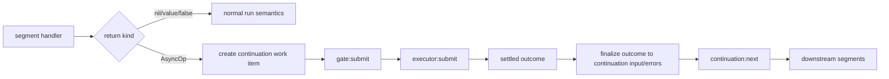
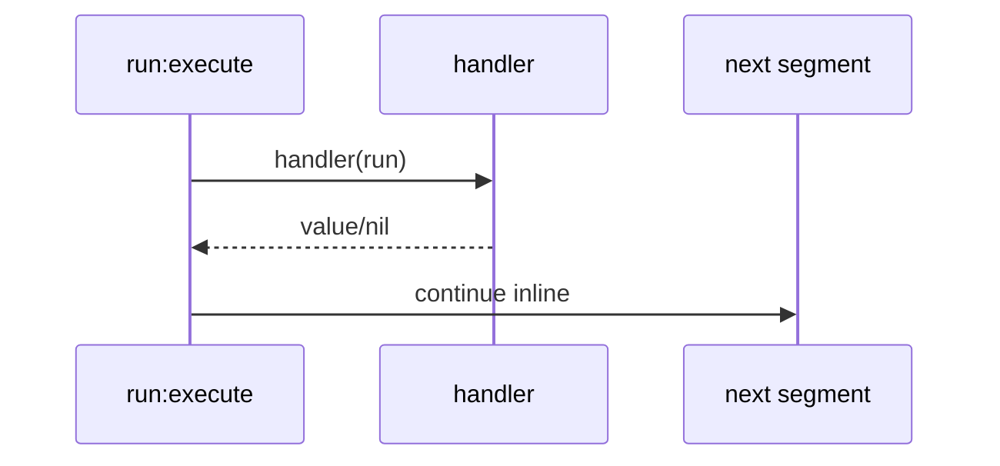
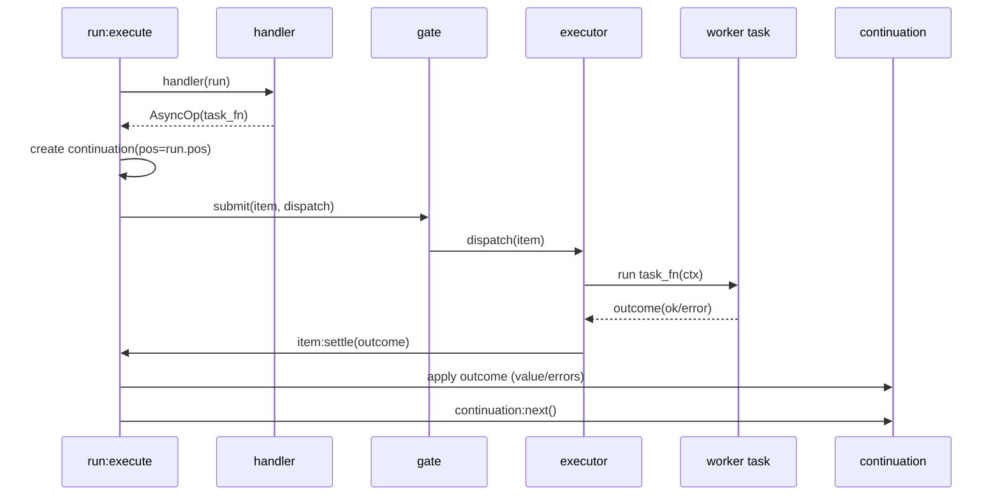

# Async Architecture v5: Gate + Executor with Deferred Async Operations

> Status: Discovery
> Date: 2026-03-16
> Supersedes: [async4.md](/doc/discovery/async4.md)
> Revises: [adr-async-boundary-segments.md](/doc/discovery/adr-async-boundary-segments.md)

This document defines the next async model for pipe-line after the boundary-segment and transport-wrapper experiments.

The short version:

- No explicit boundary segments in the pipe.
- Async is detected from handler return type.
- Async processing is split into two distinct runtime roles:
  - **gate**: ingress admission and backpressure
  - **executor**: egress async execution and continuation resume
- Segment handlers should return **deferred async operations** (task functions), not `coop.spawn(...)` tasks.
- Stop behavior is explicit with `stop_drain` and `stop_immediate`.
- Errors are propagated as data downstream by default.

This is a clean-slate design. Backward compatibility with transport wrappers and explicit `mpsc_handoff` boundaries is not a goal.

## Why v5 Exists

v4 moved async detection into [`/lua/pipe-line/run.lua`](/lua/pipe-line/run.lua), which is directionally correct. But review uncovered two design gaps:

1. **Ingress and egress were conflated.**
   - A single driver object was expected to both gate intake and execute async work.
   - Admission policies (semaphore, backpressure) and execution policies (worker/task context) are different concerns.

2. **Async authoring had a performance contradiction.**
   - Examples used `coop.spawn(...)` in handlers.
   - That allocates a coroutine per message before the driver sees the work item.
   - This defeats the point of long-lived queue consumers.

v5 solves both:

- split roles into gate + executor
- introduce a first-class deferred async operation API (`task_fn` op)

## Goals

1. Keep pipe definitions focused on business work, not async plumbing.
2. Make ingress control explicit and configurable (semaphore/backpressure).
3. Keep async execution in stable task context (for `coop.uv` compatibility).
4. Eliminate per-message `coop.spawn` overhead in normal segment authoring.
5. Preserve deterministic continuation semantics.
6. Make stop semantics and error propagation explicit and testable.

## Non-goals

1. Preserve old transport wrapper APIs.
2. Keep explicit boundary segments (`mpsc_handoff`) as primary async API.
3. Support run-level async policy overrides (`run:set_fact(...)` etc) for gate/executor controls.
4. Implement true multi-consumer `MpscQueue` behavior in v5 core (coop queue is single-consumer waiter).

## Reference Materials

| Area | Source | Why it matters |
|------|--------|----------------|
| Current run loop | [`/lua/pipe-line/run.lua`](/lua/pipe-line/run.lua) | Async detection insertion point |
| Current line lifecycle | [`/lua/pipe-line/line.lua`](/lua/pipe-line/line.lua) | prepare/stop orchestration |
| Current registry | [`/lua/pipe-line/registry.lua`](/lua/pipe-line/registry.lua) | Named resolution pattern |
| Current explicit consumer | [`/lua/pipe-line/consumer.lua`](/lua/pipe-line/consumer.lua) | Legacy queue draining model |
| Current driver timer utility | [`/lua/pipe-line/driver.lua`](/lua/pipe-line/driver.lua) | Prior `driver` meaning |
| Segment contract docs | [`/doc/segment.md`](/doc/segment.md) | Existing handler/lifecycle semantics |
| Async v4 proposal | [`/doc/discovery/async4.md`](/doc/discovery/async4.md) | Immediate predecessor |
| Boundary ADR | [`/doc/discovery/adr-async-boundary-segments.md`](/doc/discovery/adr-async-boundary-segments.md) | Decision being revised |
| Stop strategy ADR | [`/doc/adr/adr-stop-drain-and-cancel-signal.md`](/doc/adr/adr-stop-drain-and-cancel-signal.md) | Stop policy naming and intent |
| coop queue semantics | [`gregorias/coop.nvim` `lua/coop/mpsc-queue.lua`](https://github.com/gregorias/coop.nvim/blob/main/lua/coop/mpsc-queue.lua) | Single waiting consumer constraint |
| coop task semantics | [`gregorias/coop.nvim` `lua/coop/task.lua`](https://github.com/gregorias/coop.nvim/blob/main/lua/coop/task.lua) | task context and cancellation |
| coop future semantics | [`gregorias/coop.nvim` `lua/coop/future.lua`](https://github.com/gregorias/coop.nvim/blob/main/lua/coop/future.lua) | await/pawait behavior |
| coop callback wrappers | [`gregorias/coop.nvim` `lua/coop/task-utils.lua`](https://github.com/gregorias/coop.nvim/blob/main/lua/coop/task-utils.lua) | callback-to-task-function conversion |
| coop uv wrappers | [`gregorias/coop.nvim` `lua/coop/uv.lua`](https://github.com/gregorias/coop.nvim/blob/main/lua/coop/uv.lua) | why task context is mandatory |

## Core Concepts

### 1) AsyncOp

A handler can return a dedicated async operation object (AsyncOp). This is the async handoff signal.

### 2) Gate

A gate controls **admission**:

- how much work can be in-flight
- how much work can be pending
- what to do when pending is full

### 3) Executor

An executor controls **execution**:

- where and how AsyncOps run
- task context availability (`coop.uv` calls)
- continuation resume timing

### 4) Continuation

A continuation is a cloned run that resumes after the current segment once async work settles.

### 5) Outcome

An outcome is the settled result of async work:

- success with optional value
- error with structured details

## Architecture Overview



The key design choice is that gate and executor are separate runtime objects with separate contracts.

## Handler Return Contract (v5)

`handler(run)` may return:

| Return | Meaning |
|--------|---------|
| `nil` | Keep current input, continue inline |
| non-`nil` value (except `false`) | Replace `run.input`, continue inline |
| `false` | Stop this run path |
| `AsyncOp` | Submit to gate+executor, stop inline run |

This preserves existing sync behavior while adding a clear async path.

## Async API

v5 introduces a dedicated module, tentatively [`/lua/pipe-line/async.lua`](/lua/pipe-line/async.lua), with explicit constructors.

### Constructors

```lua
local async = require("pipe-line.async")

-- Deferred async work: preferred
local op = async.task_fn(function(ctx)
  -- runs in executor task context
  local err, data = require("coop.uv").fs_read(ctx.input.fd, 4096)
  if err then
    return async.fail({ code = "fs_read", message = err })
  end
  ctx.input.data = data
  return ctx.input
end)

-- Already-running awaitable: supported but not preferred
local op2 = async.awaitable(existing_task_or_future)
```

### Why `task_fn` is preferred

`task_fn` lets the executor decide **when** work begins. That enables real ingress control.

If handlers call `coop.spawn(...)` directly, work has already started and gates become weaker or purely bookkeeping.

### Suggested AsyncOp shape

```lua
---@class AsyncOp
---@field kind 'task_fn'|'awaitable'
---@field fn? fun(ctx: table): any             -- for kind=task_fn
---@field awaitable? table                     -- for kind=awaitable
---@field meta? table                          -- optional metadata
```

### Optional fail helper

```lua
---@class AsyncFailure
---@field __pipe_line_async_fail true
---@field error table

-- async.fail({ code = "...", message = "...", detail = ... })
```

This avoids using `error(...)` for expected operational failures.

## Gate Contract

A gate admits work to an executor.

```lua
---@class Gate
---@field type string
---@field submit fun(self: Gate, item: table, dispatch: function)
---@field ensure_prepared fun(self: Gate, context: table): table|nil
---@field ensure_stopped fun(self: Gate, context: table): table|nil
```

### `submit` semantics

`submit(item, dispatch)` either:

- dispatches immediately, or
- queues item until capacity is available, or
- applies overflow policy.

The gate owns ingress accounting (`inflight`, `pending`, `accepting`).

### Built-in gates

1. `none` gate
   - no admission limit
   - immediate dispatch

2. `inflight` gate
   - semaphore + pending queue
   - uses prefixed options:
     - `gate_inflight_max`
     - `gate_inflight_pending`
     - optional `gate_inflight_overflow`

## Executor Contract

An executor runs AsyncOps and settles outcomes.

```lua
---@class Executor
---@field type string
---@field submit fun(self: Executor, item: table)
---@field ensure_prepared fun(self: Executor, context: table): table|nil
---@field ensure_stopped fun(self: Executor, context: table): table|nil
```

`item` includes:

- continuation run
- AsyncOp
- stable segment/line identity
- one settlement callback (`item:settle(outcome)`) that must be called exactly once

### Built-in executors

1. `buffered` (default)
   - one long-lived worker task
   - queue-backed
   - worker executes op and settles continuation

2. `direct` (expert)
   - minimal buffering
   - tight producer/consumer coupling

v5 default should prioritize correctness and debuggability (`buffered`).

## Work Item and Settlement

To make gate and executor composable, runtime creates a work item that represents one async handoff.

Suggested item fields:

```lua
{
  line = line,
  segment = seg,
  run = run,
  continuation = continuation,
  op = op,
  settled = false,
  settle = function(outcome) ... end,
}
```

### Outcome shape

```lua
-- success
{ status = "ok", value = value_or_nil }

-- failure
{ status = "error", error = { code = "...", message = "...", detail = ... } }
```

`settle(...)` must be idempotent against double-calls.

## Continuation Cursor Invariant

This must be explicit to avoid off-by-one bugs.

If completion path calls `continuation:next()`, then continuation should be created with:

```lua
continuation = run:clone(run.input)
continuation.pos = run.pos
```

Reason:

- current segment is at `run.pos`
- `next()` increments to `run.pos + 1`
- execution resumes at the immediate downstream segment

If using `execute()` instead of `next()`, cursor setup is different. v5 standardizes on `next()` to keep semantics consistent.

## Configuration Model

v5 sets gate/executor options only at segment or line scope.

Run/fact overrides are not part of the model.

### Resolution chain

Gate:

```
segment.gate -> line.default_gate -> built-in 'none'
```

Executor:

```
segment.executor -> line.default_executor -> built-in 'buffered'
```

Options:

```
segment option -> line option -> built-in default
```

### Core options

| Field | Scope | Default | Meaning |
|-------|-------|---------|---------|
| `default_gate` | line | `"none"` | default gate ref |
| `default_executor` | line | `"buffered"` | default executor ref |
| `gate_inflight_max` | line/segment | `nil` | max in-flight items admitted by gate (`nil` means unbounded gate) |
| `gate_inflight_pending` | line/segment | `nil` | max pending items in gate queue (`nil` means unbounded pending) |
| `gate_inflight_overflow` | line/segment | `"error"` | overflow policy (`error`, `drop_newest`, `drop_oldest`) |
| `gate_auto_prepare` | line/segment | `true` | prepare gate during lifecycle |
| `executor_auto_prepare` | line/segment | `true` | prepare executor during lifecycle |
| `gate_stop_type` | line/segment | `"stop_drain"` | gate stop strategy |
| `executor_stop_type` | line/segment | `"stop_drain"` | executor stop strategy |

## Registry Extensions

Registry gains gate and executor namespaces in addition to segment resolution.

```lua
registry:register_gate("none", gates.none)
registry:register_gate("inflight", gates.inflight)

registry:register_executor("buffered", executors.buffered)
registry:register_executor("direct", executors.direct)

-- and corresponding resolve methods
registry:resolve_gate(name)
registry:resolve_executor(name)
```

This preserves the existing named-reference style for line/segment config.

## Lifecycle and Instance Ownership

### Per-segment-instance ownership

Gate and executor instances are cached on segment instances, not registry prototypes.

Suggested private fields:

- `seg._gate_instance`
- `seg._executor_instance`

This matches existing line instancing behavior in [`/lua/pipe-line/line.lua`](/lua/pipe-line/line.lua).

### Preparation policy

Two valid startup paths:

1. `ensure_prepared` path
   - if segment explicitly declares gate/executor and auto-prepare enabled
   - line lifecycle prepares instances ahead of first message

2. lazy path
   - first AsyncOp return resolves and prepares gate/executor on demand

This supports both eager and lazy runtime styles.

## Stop Semantics

v5 keeps explicit strategy names from stop ADR direction: `stop_drain` and `stop_immediate`.

### `stop_drain`

- gate stops admitting new work
- gate allows pending to continue dispatch
- executor finishes in-flight and pending-dispatched work
- stop resolves when inflight and pending are fully settled

### `stop_immediate`

- gate stops admitting new work
- gate drops pending according to immediate-stop behavior
- executor cancels active workers/tasks
- stop resolves when cancellation and cleanup settle

### Why separate gate/executor stop fields

Ingress and egress may need different policy in advanced scenarios. v5 keeps independent fields (`gate_stop_type`, `executor_stop_type`) while defaulting both to `stop_drain`.

## Error Propagation as Data

Default behavior: async errors are attached to payload and forwarded to downstream segments.

### Rationale

- Keeps the pipeline alive for observability and fallback handling.
- Avoids silent task death where continuation never resumes.
- Lets downstream policies decide drop/retry/report behavior.

### Suggested payload metadata

```lua
input._pipe_line = input._pipe_line or {}
input._pipe_line.errors = input._pipe_line.errors or {}

table.insert(input._pipe_line.errors, {
  stage = "executor",
  segment_type = seg.type,
  segment_id = seg.id,
  source = line:full_source(),
  code = err.code,
  message = err.message,
  detail = err.detail,
})
```

If input is non-table, runtime may wrap it into a table envelope in v5. This is acceptable in a clean-slate redesign.

### Segment helper toolkit

Add helpers (tentative [`/lua/pipe-line/errors.lua`](/lua/pipe-line/errors.lua)):

- `errors.has(input)`
- `errors.list(input)`
- `errors.add(input, err)`
- `errors.guard(handler)`

Common segment pattern:

```lua
handler = errors.guard(function(run)
  -- normal segment work only when no prior errors
  return transform(run.input)
end)
```

## Why Ingress as Explicit Boundary Segment Was Rejected

A tempting design is `semaphore_acquire` + `async_work` + `semaphore_release` as explicit segments.

We reject this for core v5 for correctness reasons:

1. permit release can be skipped on early stop paths
2. fan-out and fork semantics complicate ownership
3. errors/cancellation create release leaks unless every path finalizes correctly
4. pipe readability degrades back into plumbing entries

Gate objects make permit lifecycle explicit in one place, with settlement hooks guaranteed by runtime.

## Why We Avoid Full `run -> segment -> line` Metatable Chaining

The idea is attractive for config ergonomics, but v5 intentionally keeps config lookup explicit.

Reasons:

1. hidden lookup order is harder to debug
2. accidental field shadowing becomes likely
3. behavior changes when fields are added to any layer

v5 should provide explicit lookup helpers instead:

```lua
run:cfg("gate_inflight_max")
run:cfg("executor_stop_type")
```

where `cfg` resolves deterministic scope:

```
segment -> line -> built-in default
```

## Execution Walkthrough

### Sync segment



### Async segment (`task_fn`)



## Buffered Executor Notes (v5 baseline)

`coop.MpscQueue` supports many producers but only one waiting consumer task. v5 baseline should respect this.

Implications:

- default buffered executor uses one queue consumer task
- no pretending that multiple idle consumers can wait on one queue
- if future multi-worker support is needed, use dispatcher + worker inboxes, not many `queue:pop()` waiters

Ingress gate still adds value in baseline by bounding pending queue growth and controlling acceptance policy.

## Suggested Module Layout

```
lua/pipe-line/
  async.lua                 -- AsyncOp constructors: task_fn, awaitable, fail
  gate/
    init.lua                -- none, inflight
    none.lua
    inflight.lua
  executor/
    init.lua                -- buffered, direct
    buffered.lua
    direct.lua
  async-runtime.lua         -- resolve gate/executor, build work item, settlement
  run.lua                   -- detect AsyncOp and hand off to async-runtime
  line.lua                  -- default_gate/default_executor + prepare/stop hooks
  registry.lua              -- register/resolve gate and executor
  errors.lua                -- error-as-data helper toolkit
```

## Target Changes by Existing File

| File | v5 direction |
|------|--------------|
| [`/lua/pipe-line/run.lua`](/lua/pipe-line/run.lua) | detect AsyncOp and submit to async-runtime |
| [`/lua/pipe-line/line.lua`](/lua/pipe-line/line.lua) | add default gate/executor options and lifecycle prep/stop |
| [`/lua/pipe-line/registry.lua`](/lua/pipe-line/registry.lua) | add `register_gate`, `resolve_gate`, `register_executor`, `resolve_executor` |
| [`/lua/pipe-line/consumer.lua`](/lua/pipe-line/consumer.lua) | remove (fold behavior into executor implementations) |
| [`/lua/pipe-line/driver.lua`](/lua/pipe-line/driver.lua) | replace with gate/executor model |
| [`/lua/pipe-line/segment/mpsc.lua`](/lua/pipe-line/segment/mpsc.lua) | deprecate/remove from core async path |
| [`/lua/pipe-line/segment/define/transport.lua`](/lua/pipe-line/segment/define/transport.lua) | remove |
| [`/lua/pipe-line/segment/define/transport/mpsc.lua`](/lua/pipe-line/segment/define/transport/mpsc.lua) | remove |

## Authoring Examples

### Minimal async segment (preferred)

```lua
local async = require("pipe-line.async")
local uv = require("coop.uv")

registry:register("file_reader", {
  type = "file_reader",
  gate = "inflight",         -- optional; can rely on line default
  executor = "buffered",     -- optional; can rely on line default
  gate_inflight_max = 1,
  gate_inflight_pending = 128,

  handler = function(run)
    return async.task_fn(function(ctx)
      local err, fd = uv.fs_open(ctx.input.path, "r", 438)
      if err then
        return async.fail({ code = "fs_open", message = err })
      end

      local err2, data = uv.fs_read(fd, 4096)
      uv.fs_close(fd)
      if err2 then
        return async.fail({ code = "fs_read", message = err2 })
      end

      ctx.input.content = data
      return ctx.input
    end)
  end,
})
```

### Line defaults

```lua
local line = pipeline({
  default_gate = "none",
  default_executor = "buffered",

  gate_inflight_max = nil,
  gate_inflight_pending = nil,
  gate_inflight_overflow = "error",

  gate_stop_type = "stop_drain",
  executor_stop_type = "stop_drain",
})
```

### Optional eager prepare control

```lua
local line = pipeline({
  gate_auto_prepare = true,
  executor_auto_prepare = true,
})
```

If either is false, first AsyncOp on a segment may lazily initialize the instance.

## Design Decisions (Summary)

1. **No explicit async boundary segments.**
   - Pipe should represent business work steps, not transport plumbing.

2. **Gate and executor are separate first-class roles.**
   - Admission and execution concerns remain independent and composable.

3. **`task_fn` AsyncOp is the primary async API.**
   - Avoid per-message `coop.spawn` overhead.
   - Preserve task context for async I/O wrappers.

4. **Segment/line scope for async policy; no run/fact async overrides.**
   - Predictable behavior and simpler debugging.

5. **Stop semantics are explicit per role.**
   - `stop_drain` and `stop_immediate` are required policy names.

6. **Errors are data by default.**
   - Runtime does not silently swallow async failures.

7. **One-consumer queue reality is honored in baseline executor.**
   - No invalid multi-waiter assumptions on coop MPSC queue.

## Migration Notes

This is intentionally a redesign, not an adapter layer.

Expected breakage areas:

- tests that assert explicit handoff segment behavior
- tests that inspect queue envelopes/HANDOFF_FIELD
- tests that rely on `run.continuation`
- tests around `auto_start_consumers`

These should be replaced with gate/executor and AsyncOp tests.

## Test Plan Focus for v5

1. `run:execute` async detection for AsyncOp and sync behavior parity.
2. continuation cursor correctness (`pos` + `next`).
3. gate inflight/pending accounting and overflow behavior.
4. executor settlement exactly-once guarantees.
5. stop strategy behavior (`stop_drain`, `stop_immediate`) for both gate and executor.
6. error-as-data propagation through downstream segments.
7. lifecycle idempotency (`ensure_prepared`, `ensure_stopped`).
8. per-segment-instance gate/executor caching under auto instancing.

## Open Questions

1. Should v5 accept raw awaitables directly, or require `async.awaitable(...)` wrapping for all async returns?
2. For non-table payloads, should error propagation always wrap into an envelope table, or provide an alternate side-channel on run metadata?
3. Should `gate_inflight_overflow = "error"` include line-level logging and structured telemetry by default?
4. Do we want an optional fail-fast mode in core (`line.async_fail_fast = true`) in addition to default pass-through error data?
5. Should `direct` executor be in core v5 initial cut, or deferred until buffered path and gate semantics are fully stable?

## Closing

v5 keeps the best insight from v4 (implicit async via return semantics) while correcting two critical model issues:

- ingress policy is not egress execution
- async authoring should not eagerly spawn per message

By splitting gate and executor, introducing deferred AsyncOps, and standardizing stop/error behavior, we get a model that is simpler to author, easier to reason about, and more robust under load and shutdown.
