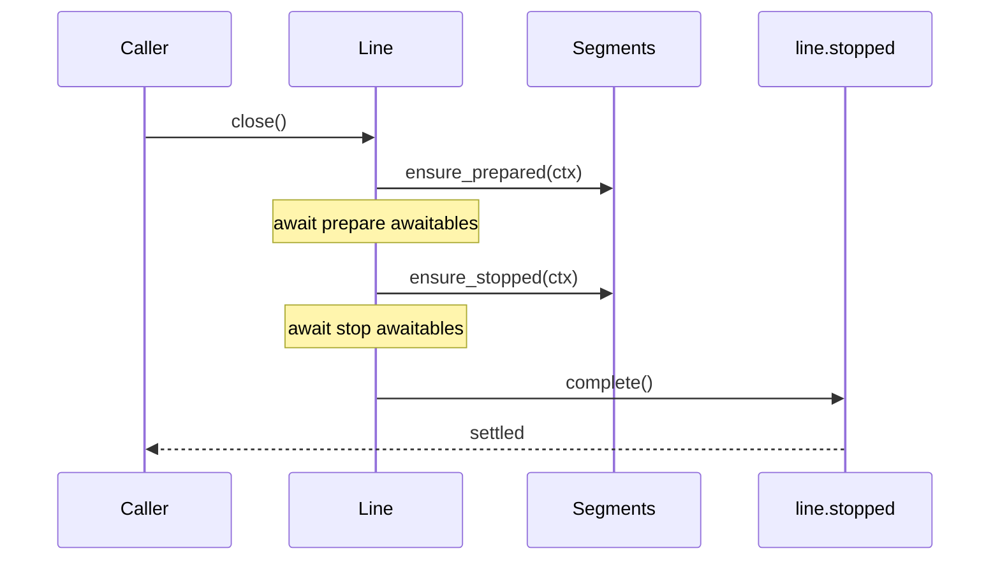

# Line

`Line` is the pipeline definition and orchestration object in pipe-line. It owns pipeline configuration, segment materialization behavior, output queue wiring, and high-level lifecycle operations (`ensure_prepared`, `ensure_stopped`, `close`).

If `Run` is the per-message cursor, `Line` is the control tower.

## Reference Materials

| Area | Source | Why it matters |
|------|--------|----------------|
| Line implementation | [`/lua/pipe-line/line.lua`](/lua/pipe-line/line.lua) | Canonical line behavior, defaults, lifecycle orchestration, child/fork semantics |
| Run execution | [`/lua/pipe-line/run.lua`](/lua/pipe-line/run.lua) | Line creates runs and delegates message walking to run |
| Segment library | [`/lua/pipe-line/segment.lua`](/lua/pipe-line/segment.lua) | Default segment stack and built-in segment behavior |
| Async boundary segment | [`/lua/pipe-line/segment/mpsc.lua`](/lua/pipe-line/segment/mpsc.lua) | Explicit handoff segment that line can insert/manage |
| Completion segment | [`/lua/pipe-line/segment/completion.lua`](/lua/pipe-line/segment/completion.lua) | Completion-driven shutdown behavior |
| Registry resolution | [`/lua/pipe-line/registry.lua`](/lua/pipe-line/registry.lua) | Line resolves named segments through registry chain |

## Core Responsibilities

Line is responsible for:

- owning a pipe definition (`line.pipe`)
- creating runs (`line:run(config)`)
- resolving and materializing pipeline segments
- orchestrating lifecycle hooks across segments
- exposing convenience logging methods (`line:info`, `line:error`, etc.)
- managing inheritance (`child`) and independent derivation (`fork`)

## Construction and Defaults

A line is created by calling module entrypoint or `Line(config)`.

Default segment stack:

- `timestamper`
- `ingester`
- `cloudevent`
- `module_filter`
- `completion`

Root defaults include:

- `stopped = Future.new()`
- `auto_completion_done_on_close = true`
- `auto_id = true`
- `auto_fork = true`
- `auto_instance = true`
- `pipe = Pipe(Line.defaultSegment)`
- `output = MpscQueue.new()`
- `fact = {}`
- `sourcer = logutil.full_source`

Child lines inherit through parent chain unless explicitly shadowed.

## Message Entry

Primary execution entry:

```lua
line:run({ input = payload })
```

Logging helpers normalize payload then call `line:run(...)`:

- `line:error`
- `line:warn`
- `line:info`
- `line:debug`
- `line:trace`
- `line:log`

## Segment Resolution and Materialization

Before execution/lifecycle, line resolves pipe entries:

- string entries to registry lookup (`line:resolve_segment`)
- table entries may be instantiated per-line (`auto_fork`, `auto_instance`)
- segment factories may be materialized into concrete segment objects

Segment identity assignment:

- `seg.type` ensured
- `seg.id` assigned when `auto_id ~= false`

## Selection APIs

### `line:select_segments(selector?, opts?)`

Select runtime segment instances by:

- `nil` -> all table segments
- string -> match `seg.type`
- predicate function -> custom matching

`opts.materialize` controls whether factories are materialized during selection.

### `line:stopped_live(selector?)`

Returns a future that settles when:

- currently matching segment `stopped` awaitables settle
- newly discovered matching awaitables also settle
- line stop state is complete

This is the targeted wait primitive for type-based shutdown observation.

## Lifecycle Orchestration

### `line:ensure_prepared()`

Runs `segment.ensure_prepared(context)` for each segment and awaits collected awaitables.

Context fields:

- `line`
- `pos`
- `segment`
- `force = true` (for line lifecycle path)

### `line:ensure_stopped()`

Stops the line lifecycle:

1. collect existing `seg.stopped` handles
2. call each `segment.ensure_stopped(context)`
3. collect returned awaitables
4. await all
5. resolve `line.stopped`

### `line:close()`

High-level sequence:

1. `ensure_prepared()`
2. `ensure_stopped()`



## Async Boundary Integration

Line can inject queue boundaries with:

- `line:addHandoff(pos?, config?)`

`mpsc_handoff` behavior in line lifecycle:

- consumer startup comes from `ensure_prepared`
- consumer shutdown comes from `ensure_stopped`
- handler returns `false` on handoff and continuation run resumes later

Consumer auto-start control currently checks `line.autoStartConsumers` in transport mpsc implementation.

## Completion Protocol Integration

The default `completion` segment is part of `Line.defaultSegment`.

Key interactions:

- `ensure_prepared` emits one `hello` control run
- `ensure_stopped` emits one `done` control run unless `auto_completion_done_on_close == false`
- completion segment resolves its own `stopped` state when settled

This gives close-time completion accounting without custom orchestration at callsite.

## Child vs Fork

### `line:child(...)`

- thin inherited line
- local source override, parent read-through for most fields

### `line:fork(...)`

- child-like derivation plus owned state:
  - cloned `pipe`
  - new `output`
  - copied `fact`

Use `child` for cheap contextual derivation, `fork` for execution independence.

## Runtime Pipe Mutation

`line:spliceSegment(pos, delete_count, ...)` mutates pipe and resets instance/init caches.

Inserted segments run `init` immediately in splice path.

Runs remain position-correct via run-side splice journal sync (`run:sync()`).

## Relationship to Other Core Components

- **Run** executes the per-message algorithm under line governance. See [`/doc/run.md`](/doc/run.md).
- **Segment** defines handler/lifecycle contracts line calls. See [`/doc/segment.md`](/doc/segment.md).
- **Registry** resolves named segment references used by line. See [`/doc/registry.md`](/doc/registry.md).
