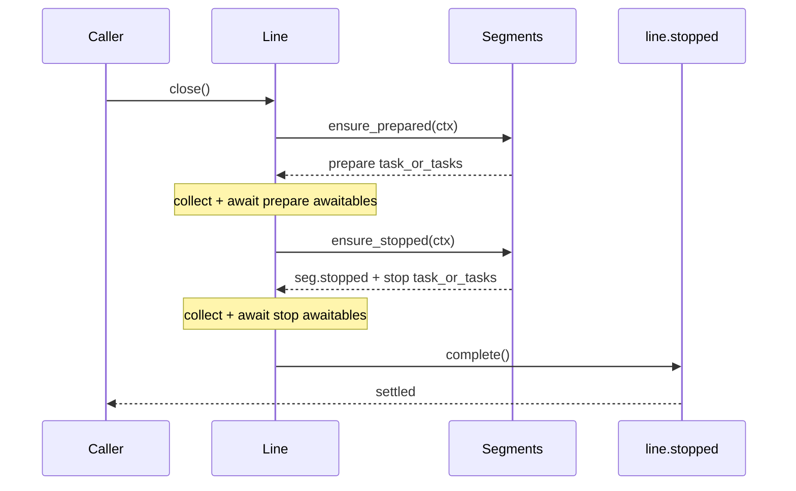

# Line

`Line` is the pipeline definition and orchestration object in pipe-line. It owns pipeline configuration, segment materialization behavior, output queue wiring, and high-level lifecycle operations (`ensure_prepared`, `ensure_stopped`, `close`).

If `Run` is the per-message cursor, `Line` is the control tower.

## Reference Materials

| Area | Source | Why it matters |
|------|--------|----------------|
| Line implementation | [`/lua/pipe-line/line.lua`](/lua/pipe-line/line.lua) | Canonical line behavior, defaults, lifecycle orchestration, child/fork semantics |
| Run execution | [`/lua/pipe-line/run.lua`](/lua/pipe-line/run.lua) | Line creates runs and delegates message walking to run |
| Segment library | [`/lua/pipe-line/segment.lua`](/lua/pipe-line/segment.lua) | Default segment stack and built-in segment behavior |
| Async boundary segment | [`/lua/pipe-line/segment/mpsc.lua`](/lua/pipe-line/segment/mpsc.lua) | Explicit handoff segment that line can insert/manage |
| Completion segment | [`/lua/pipe-line/segment/completion.lua`](/lua/pipe-line/segment/completion.lua) | Completion-driven shutdown behavior |
| Registry resolution | [`/lua/pipe-line/registry.lua`](/lua/pipe-line/registry.lua) | Line resolves named segments through registry chain |

## Core Responsibilities

| Responsibility | Description |
|----------------|-------------|
| pipe ownership | owns active pipeline definition (`line.pipe`) |
| run creation | creates run instances (`line:run(config)`) |
| segment materialization | resolves names/factories into runtime segment instances |
| lifecycle orchestration | drives `ensure_prepared` and `ensure_stopped` across the pipe |
| logging facade | exposes level-specific convenience methods (`error`, `warn`, `info`, `debug`, `trace`, `log`) |
| derivation control | provides inherited `child` and independent `fork` line creation |

## Construction and Defaults

A line is created by calling module entrypoint or `Line(config)`.

Default segment stack:

| Order | Segment |
|-------|---------|
| 1 | `timestamper` |
| 2 | `ingester` |
| 3 | `cloudevent` |
| 4 | `module_filter` |
| 5 | `completion` |

Root defaults include:

| Field | Default |
|-------|---------|
| `stopped` | `Future.new()` |
| `auto_completion_done_on_close` | `true` |
| `auto_id` | `true` |
| `auto_fork` | `true` |
| `auto_instance` | `true` |
| `pipe` | `Pipe(Line.defaultSegment)` |
| `output` | `MpscQueue.new()` |
| `fact` | `{}` |
| `sourcer` | `logutil.full_source` |

Child lines inherit through parent chain unless explicitly shadowed.

## Message Entry

Primary execution entry:

```lua
line:run({ input = payload })
```

Logging helpers normalize payload then call `line:run(...)`:

| Method | Role |
|--------|------|
| `line:error` | normalize at error level and run |
| `line:warn` | normalize at warn level and run |
| `line:info` | normalize at info level and run |
| `line:debug` | normalize at debug level and run |
| `line:trace` | normalize at trace level and run |
| `line:log` | generic normalize-and-run entry |

## Segment Resolution and Materialization

Before execution/lifecycle, line resolves pipe entries:

| Pipe entry shape | Resolution behavior |
|------------------|---------------------|
| string | resolve via `line:resolve_segment` and registry chain |
| table | may be instantiated per-line depending on `auto_fork` / `auto_instance` |
| segment factory | may be materialized into concrete segment object |

Segment identity assignment:

| Identity field | Behavior |
|----------------|----------|
| `seg.type` | ensured for runtime segment tables |
| `seg.id` | assigned when `auto_id ~= false` |

## Selection APIs

### `line:select_segments(selector?, opts?)`

Select runtime segment instances by:

| Selector form | Meaning |
|---------------|---------|
| `nil` | all table segments |
| string | match `seg.type` |
| function | custom predicate on `(seg, { line, pos })` |

`opts.materialize` controls whether factories are materialized during selection.

Example usage:

```lua
local all = line:select_segments()
local completions = line:select_segments("completion")

local later_handoffs = line:select_segments(function(seg, ctx)
  return seg.type == "mpsc_handoff" and ctx.pos > 1
end)
```

Predicate context fields:

- `ctx.line`
- `ctx.pos`

### `line:stopped_live(selector?)`

Returns a future that settles when:

| Condition | Meaning |
|-----------|---------|
| current matches settled | already-known matching `seg.stopped` awaitables settle |
| future matches settled | newly discovered matching awaitables also settle |
| line stop settled | line-level stop state is complete |

This is the targeted wait primitive for type-based shutdown observation.

Example:

```lua
local completion_stop = line:stopped_live("completion")
line:close()
completion_stop:await(1000, 10)
```

## Lifecycle Orchestration

### `line:ensure_prepared()`

Runs `segment.ensure_prepared(context)` for each segment and awaits collected awaitables.

Context fields:

| Context key | Meaning |
|-------------|---------|
| `line` | current line instance |
| `pos` | segment position in pipe |
| `segment` | runtime segment instance |
| `force` | true for line lifecycle orchestration path |

Run path note:

- `Run:execute()` may also call `seg:ensure_prepared(...)` with run context (`run`, `line`, `pos`, `segment`) for just-in-time readiness.
- line lifecycle path is still the authoritative whole-line orchestration path.

### `line:ensure_stopped()`

Stops the line lifecycle:

| Step | Operation |
|------|-----------|
| 1 | collect existing `seg.stopped` handles |
| 2 | call each `segment.ensure_stopped(context)` |
| 3 | collect returned awaitables |
| 4 | await all collected stop awaitables |
| 5 | resolve `line.stopped` |

### `line:close()`

High-level sequence:

1. `ensure_prepared()`
2. `ensure_stopped()`



### Stop Strategy Status (TODO)

Task transport stop strategy (`stop_type`, `stop_drain`, `stop_immediate`) is defined in ADRs, but line-level docs and implementation wiring are still being tightened (TODO).

Current intent:

- `ensure_stopped` should wait according to selected strategy.
- strategy-specific helpers/futures should be explicit and composable.

See [`/doc/adr/adr-stop-drain-and-cancel-signal.md`](/doc/adr/adr-stop-drain-and-cancel-signal.md).

## Async Boundary Integration

Line can inject queue boundaries with:

| API | Purpose |
|-----|---------|
| `line:addHandoff(pos?, config?)` | insert explicit `mpsc_handoff` boundary into pipe |

`mpsc_handoff` behavior in line lifecycle:

| Lifecycle phase | Boundary behavior |
|-----------------|-------------------|
| prepare | starts queue consumer path |
| stop | stops queue consumer path |
| run execution | handler returns `false` after handoff; continuation run resumes later |

Consumer auto-start control currently uses `line.auto_start_consumers` in transport mpsc implementation.

## Completion Protocol Integration

The default `completion` segment is part of `Line.defaultSegment`.

Key interactions:

| Interaction | Effect |
|-------------|--------|
| `ensure_prepared` | emits one `hello` control run |
| `ensure_stopped` | emits one `done` control run unless auto done is disabled |
| completion handler state | resolves completion segment `stopped` future when settled |

This gives close-time completion accounting without custom orchestration at callsite.

## Child vs Fork

| API | Inheritance model | Owned state changes |
|-----|-------------------|---------------------|
| `line:child(...)` | thin inherited line | local source override; parent read-through for most fields |
| `line:fork(...)` | child-like derivation | owns cloned `pipe`, new `output`, copied `fact` |

Use `child` for cheap contextual derivation, `fork` for execution independence.

## Runtime Pipe Mutation

`line:spliceSegment(pos, delete_count, ...)` mutates pipe and resets instance/init caches.

Inserted segments run `init` immediately in splice path.

Runs remain position-correct via run-side splice journal sync (`run:sync()`).

## Segment Instancing on Line

Line owns runtime segment materialization policy through:

- `auto_fork`
- `auto_instance`
- `auto_id`

Line also runs `seg:init(context)` when materializing runtime segments. If `init` returns an awaitable and `seg.stopped` is unset, the awaitable is stored as `seg.stopped` for later stop orchestration.

## Relationship to Other Core Components

| Component | Relationship to Line |
|-----------|----------------------|
| [`/doc/run.md`](/doc/run.md) | executes per-message algorithm under line orchestration |
| [`/doc/segment.md`](/doc/segment.md) | defines handler/lifecycle contract line invokes |
| [`/doc/registry.md`](/doc/registry.md) | resolves named segment references used by line |
