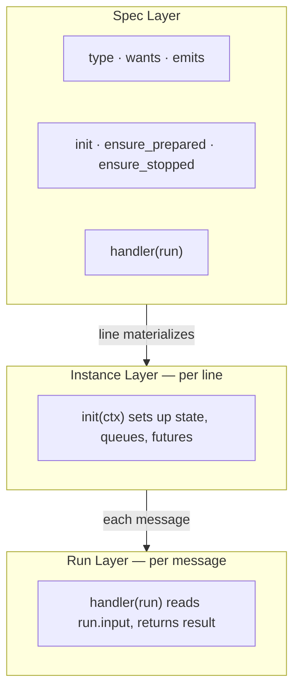

# Segments

This guide covers the segment model in general: contract, lifecycle, sync behavior, async boundary behavior, and runtime identity.

References:

- [`/lua/pipe-line/segment.lua`](/lua/pipe-line/segment.lua)
- [`/lua/pipe-line/segment/define.lua`](/lua/pipe-line/segment/define.lua)
- [`/lua/pipe-line/line.lua`](/lua/pipe-line/line.lua)
- [`/lua/pipe-line/run.lua`](/lua/pipe-line/run.lua)
- [`/doc/lifecycle.md`](/doc/lifecycle.md)
- [`/doc/async-handoff.md`](/doc/async-handoff.md)

## Core Contract

Segment behavior is centered on one run-facing verb:

- `handler(run)`

Lifecycle hooks:

- `init(context)`
- `ensure_prepared(context)`
- `ensure_stopped(context)`

## Segment Layers

Segment code is easiest to reason about in three layers:

1. **Spec layer**: static fields (`type`, `wants`, `emits`, hook definitions)
2. **Instance layer**: per-line setup in `init(context)`
3. **Run layer**: per-message behavior in `handler(run)`



Use `init` for per-instance defaults and state. Avoid mutating shared prototypes at run time.

## Minimal Segment

The smallest segment is a function taking `run`.

```lua
registry:register("tagger", function(run)
  run.input.tagged = true
  return run.input
end)
```

## Table Segment Shape

```lua
registry:register("my_segment", {
  type = "my_segment",
  wants = { "time" },
  emits = { "validated" },

  init = function(self, ctx)
    -- per-instance setup (state/futures/queues/counters)
  end,

  ensure_prepared = function(self, ctx)
    -- optional readiness/start hook
    -- may return awaitable or awaitable list
  end,

  handler = function(run)
    run.input.validated = true
    return run.input
  end,

  ensure_stopped = function(self, ctx)
    -- optional stop hook
    -- may return awaitable or awaitable list
  end,
})
```

## Handler Return Semantics

Current shorthand semantics:

- non-`nil`: replaces `run.input`
- `false`: stop this run path
- `nil`: keep current `run.input` unchanged

## Sync vs Async Segment Behavior

### Sync segment

- returns transformed value (`run.input` replacement) or `nil`
- run continues inline to next segment

### Async boundary segment

- initiates async handoff in `handler(run)`
- returns `false` to stop inline path now
- later resumes via continuation run `:next(...)`

## Async Boundary Handler Contract

When a boundary segment hands off a continuation run to async transport, it should:

1. hand off continuation ownership (`queue:push(...)`, pending append, task handoff)
2. return `false` from `handler(run)`
3. resume later with `continuation:next(...)`

In short: **stop now, continue later**.

### Why `false` matters

`Run:execute()` interprets `false` as stop-this-run-path now.

This prevents double flow:

- wrong: inline path continues, and async path also continues later
- right: inline path stops at boundary, only continuation path resumes later

### Run-owned continuation

Continuation ownership is run-centric.

- tracking field: `run.continuation`
- continuation shape is flexible; a single slot is acceptable

Boundary segments transport continuation runs; they do not redefine run semantics.

### Example: Queue handoff

```lua
handler = function(run)
  local continuation = run -- or clone/fork strategy
  run.continuation = continuation
  queue:push({ continuation = continuation })
  return false
end

-- later, in worker/consumer:
local message = queue:pop()
message.continuation:next()
```

### Failure modes to avoid

- returning `nil`/value after handoff and also calling `continuation:next(...)` later
- calling `continuation:next(...)` multiple times for one handoff path
- treating continuation as segment-owned state instead of run-owned flow state

## Lifecycle Relationship

`ensure_prepared` and `ensure_stopped` handle transport startup/shutdown around handler contract.

- `handler(run)` decides when ownership moves to async transport
- lifecycle hooks decide when workers/queues are available and when they stop

See [`/doc/lifecycle.md`](/doc/lifecycle.md), [`/doc/async-handoff.md`](/doc/async-handoff.md), and [`/doc/adr/adr-stop-drain-and-cancel-signal.md`](/doc/adr/adr-stop-drain-and-cancel-signal.md).

## Lifecycle Context

Hook context keys:

- `init(context)`: `line`, `pos`, `segment`
- `ensure_prepared(context)`: `line`, `pos`, `segment`, `force` (line lifecycle path)
- `ensure_stopped(context)`: `line`, `pos`, `segment`, `force` (line lifecycle path)

`ensure_prepared` and `ensure_stopped` should be idempotent.

## Protocol-Aware Segments

`segment.define(...)` wraps handler behavior with protocol pass-through defaults.

```lua
local define = require("pipe-line.segment.define").define

local my_segment = define({
  type = "my_segment",
  handler = function(run)
    return run.input
  end,
})
```

This keeps protocol behavior consistent across custom segments.

## Runtime Identity

Per-line runtime segment instances are selected by `type`.

- keep `type` stable and explicit
- `id` may be assigned when `auto_id` is enabled

See [`/doc/segment-instancing.md`](/doc/segment-instancing.md).
