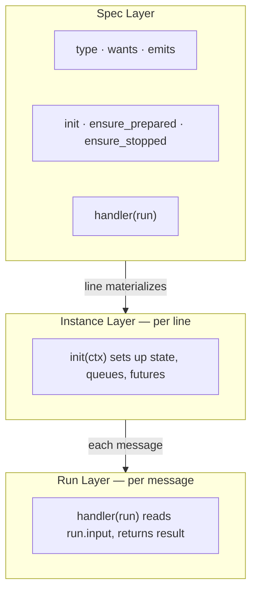
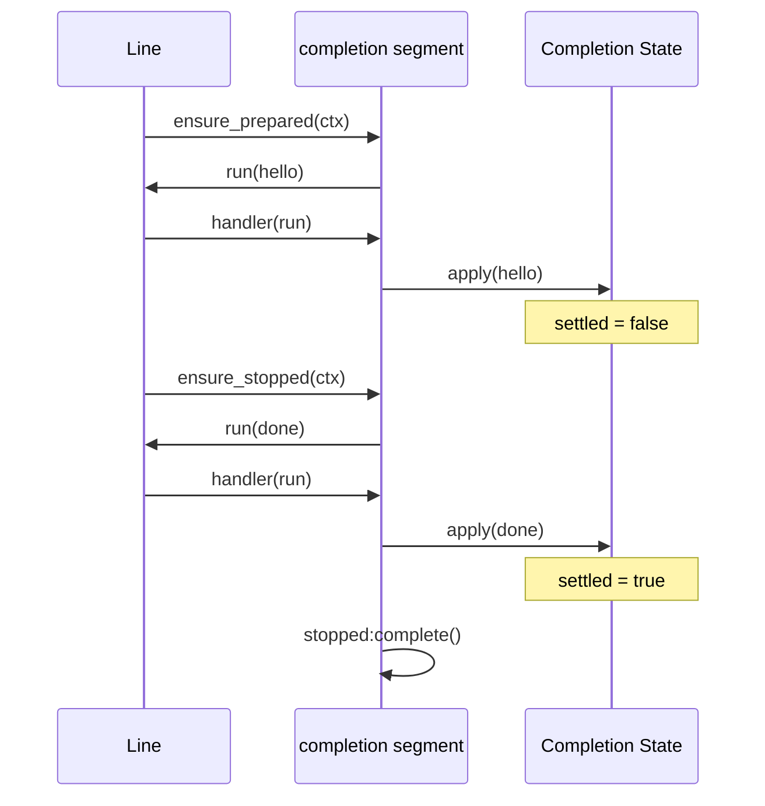

# Segment

`Segment` is the unit of pipeline behavior in pipe-line. Every run step is a segment handler invocation plus optional lifecycle hooks.

This guide covers both authoring and runtime semantics, including async boundary behavior (`mpsc_handoff`) and completion protocol behavior.

## Reference Materials

| Area | Source | Why it matters |
|------|--------|----------------|
| Built-in segment library | [`/lua/pipe-line/segment.lua`](/lua/pipe-line/segment.lua) | Canonical built-ins and core segment export surface |
| Segment definition wrapper | [`/lua/pipe-line/segment/define.lua`](/lua/pipe-line/segment/define.lua) | Protocol-aware wrapping and default handler behavior |
| Transport composition | [`/lua/pipe-line/segment/define/transport.lua`](/lua/pipe-line/segment/define/transport.lua) | How task/mpsc transport wrappers compose on core handler contract |
| MPSC boundary implementation | [`/lua/pipe-line/segment/mpsc.lua`](/lua/pipe-line/segment/mpsc.lua) | Explicit queue handoff segment |
| Completion segment | [`/lua/pipe-line/segment/completion.lua`](/lua/pipe-line/segment/completion.lua) | Completion control run handling and stop settlement |
| Line orchestration | [`/lua/pipe-line/line.lua`](/lua/pipe-line/line.lua) | Lifecycle calling context and runtime segment materialization |
| Run execution | [`/lua/pipe-line/run.lua`](/lua/pipe-line/run.lua) | Handler return interpretation and continuation re-entry |

## Core Segment Contract

| Contract surface | Description |
|------------------|-------------|
| `handler(run)` | per-message behavior entrypoint |
| `init(context)` | per-instance initialization hook |
| `ensure_prepared(context)` | readiness/start lifecycle hook |
| `ensure_stopped(context)` | stop lifecycle hook |

Context fields typically include:

| Context key | Meaning |
|-------------|---------|
| `line` | owning line |
| `pos` | segment position in pipe |
| `segment` | runtime segment instance |
| `force` | line lifecycle orchestration path marker |

`ensure_prepared` and `ensure_stopped` should be idempotent.

## Segment Layers

Segment code is easiest to reason about in three layers:

1. **Spec layer**: static fields (`type`, `wants`, `emits`, hook definitions)
2. **Instance layer**: per-line setup in `init(context)`
3. **Run layer**: per-message behavior in `handler(run)`



## Minimal Segment

```lua
registry:register("tagger", function(run)
  run.input.tagged = true
  return run.input
end)
```

## Full Table Segment Shape

```lua
registry:register("validator", {
  type = "validator",
  wants = { "time" },
  emits = { "validated" },

  init = function(self, context)
    -- per-instance state setup
  end,

  ensure_prepared = function(self, context)
    -- optional startup/readiness
    -- may return awaitable or list
  end,

  handler = function(run)
    run.input.validated = true
    return run.input
  end,

  ensure_stopped = function(self, context)
    -- optional teardown
    -- may return awaitable or list
  end,
})
```

## Handler Return Semantics

Run interprets handler returns as:

| Handler result | Run behavior |
|----------------|--------------|
| non-`nil` (except `false`) | replace `run.input` |
| `false` | stop this run path immediately |
| `nil` | keep current `run.input` |

These semantics are the foundation for both sync and async segment behavior.

## Sync and Async Segment Patterns

| Pattern | Handler behavior | Downstream effect |
|---------|------------------|-------------------|
| sync | transforms/filters and returns immediately | run continues inline |
| async boundary | hands off continuation ownership, then returns `false` | continuation run resumes later with `:next(...)` |

This avoids double flow and keeps run semantics deterministic.

Continuation ownership is run-centric:

| Field | Ownership | Shape |
|-------|-----------|-------|
| `run.continuation` | run-owned | flexible; single-slot tracking is acceptable |

## Async Transport and Completion Handoff Strategy

Segment async behavior is not one mechanism. It is two connected strategies:

| Strategy layer | Role | Typical carrier |
|----------------|------|-----------------|
| transport handoff | move continuation to async execution context | queue envelope, task pending list, task resume path |
| completion handoff | determine when shutdown/completion is considered settled | completion counters/futures and lifecycle stop hooks |

In practice:

- `mpsc_handoff` owns transport boundary behavior.
- `completion` owns completion settlement behavior.
- line lifecycle (`ensure_prepared`, `ensure_stopped`) coordinates both.

## Protocol-Aware Segment Definition

Use `segment.define(spec)` to get protocol pass-through defaults.

```lua
local define = require("pipe-line.segment.define").define

local custom = define({
  type = "custom",
  handler = function(run)
    return run.input
  end,
})
```

Protocol wrappers prevent accidental consumption of control runs unless explicitly configured.

## Built-in Segments and Roles

| Segment | Role |
|---------|------|
| `timestamper` | Adds `time` using `vim.uv.hrtime()` when absent |
| `cloudevent` | Adds CloudEvent fields (`id`, `source`, `type`, `specversion`) |
| `module_filter` | Filters by source matcher (string or function); may return `false` |
| `level_filter` | Filters by level threshold; may return `false` |
| `ingester` | Delegates custom payload decoration function |
| `completion` | Applies completion protocol accounting and resolves completion stop state |
| `mpsc_handoff` | Explicit queue boundary: hand off continuation and stop inline path |

## Async Boundary: `mpsc_handoff`

`mpsc_handoff` is the canonical boundary segment.

Basic placement pattern:

```lua
local pipeline = require("pipe-line")
local app = pipeline({ source = "myapp" })
app.pipe = pipeline.Pipe({
  "timestamper",
  "mpsc_handoff",
  "cloudevent",
})

app:info("async message")
```

Factory/config:

```lua
local segment = require("pipe-line.segment")
local handoff = segment.mpsc_handoff({
  strategy = "fork", -- self | clone | fork
})
```

Behavior summary:

| Step | Boundary behavior |
|------|-------------------|
| continuation selection | chooses strategy (`self`, `clone`, `fork`) |
| transport handoff | pushes continuation into queue envelope |
| inline stop | returns `false` |
| deferred resume | downstream consumer resumes continuation with `:next(...)` |

Manual mode pattern:

```lua
local envelope = handoff.queue:pop()
local continuation = envelope[segment.HANDOFF_FIELD]
continuation:next()
```

Lifecycle behavior for handoff boundary:

- queue consumer startup is driven by `ensure_prepared`
- queue consumer shutdown is driven by `ensure_stopped`
- `line:close()` coordinates both through line lifecycle orchestration

## Completion Protocol Segment

`completion` segment is protocol-aware and stateful.

Control fields are run-level:

| Field | Meaning |
|-------|---------|
| `pipe_line_protocol = true` | marks run as protocol/control run |
| `mpsc_completion` | completion control signal (`hello`, `done`, `shutdown`) |
| `mpsc_completion_name` | optional signal source/identity |

Completion accounting state fields:

| State field | Meaning |
|-------------|---------|
| `hello` | number of observed completion `hello` signals |
| `done` | number of observed completion `done`/`shutdown` signals |
| `settled` | `true` when `done >= hello` |
| `signal` | last seen completion signal |
| `name` | last seen completion signal name/source |
| `stopped` | completion segment stop future resolved on settlement |

Completion segment behavior:

| Hook / path | Completion behavior |
|-------------|---------------------|
| `ensure_prepared` | emits one `hello` control run |
| `ensure_stopped` | emits one `done` control run unless disabled on line |
| `handler` | applies completion counters and resolves `state.stopped` when settled |

This allows completion settlement to be modeled as regular run flow, not out-of-band queue metadata.

Lifecycle relationship:

- `ensure_prepared` and `ensure_stopped` provide protocol ingress (`hello`/`done`).
- `handler(run)` applies control runs into completion state.
- segment and line stop futures settle from observed protocol state, not from queue drains alone.

Stop strategy note (TODO):

- strategy-specific stop semantics (`stop_type`, `stop_drain`, `stop_immediate`) are ADR-defined and still being tightened in implementation/docs.
- see [`/doc/adr/adr-stop-drain-and-cancel-signal.md`](/doc/adr/adr-stop-drain-and-cancel-signal.md).

Creating control runs:

```lua
local protocol = require("pipe-line.protocol")

local hello = protocol.completion.completion_run("hello", "worker:a")
local done = protocol.completion.completion_run("done", "worker:a")

app:run(hello)
app:run(done)
```

Applying completion state in isolation:

```lua
local protocol = require("pipe-line.protocol")
local state = {}

protocol.completion.apply(state, hello)
protocol.completion.apply(state, done)

if state.settled then
  -- done >= hello
end
```

Completion lifecycle sequence:



Targeted completion wait pattern:

```lua
local completion_stopped = app:stopped_live("completion")
app:close()
completion_stopped:await(1000, 10)
```

## Segment Instancing and Identity

Runtime segments are line-bound instances, usually derived from registry prototypes.

Identity fields:

| Field | Meaning |
|-------|---------|
| `type` | segment class identity |
| `id` | runtime slot identity (when `auto_id` enabled) |

Common line controls that affect instancing:

| Line control | Effect on segment runtime instancing |
|--------------|------------------------------------|
| `auto_fork` | use `seg:fork(...)` when available |
| `auto_instance` | create metatable instance when needed |
| `auto_id` | assign runtime segment `id` |

`init(context)` is preferred for per-instance state setup.

## Segment Relationships in the System

| Component | Relationship to Segment |
|-----------|-------------------------|
| [`/doc/line.md`](/doc/line.md) | orchestrates segment lifecycle and resolution |
| [`/doc/run.md`](/doc/run.md) | executes segment handlers and applies return semantics |
| [`/doc/registry.md`](/doc/registry.md) | provides named segment prototypes |

Execution chain summary:

| Order | Step |
|-------|------|
| 1 | registry provides segment definitions |
| 2 | line resolves/materializes runtime segment instances |
| 3 | run invokes segment handlers in order |
| 4 | segments may hand off async continuation and re-enter later |

## Related Deep Dives

- Run execution details: [`/doc/run.md`](/doc/run.md)
- Line lifecycle orchestration: [`/doc/line.md`](/doc/line.md)
- Registry resolution and emits indexing: [`/doc/registry.md`](/doc/registry.md)
